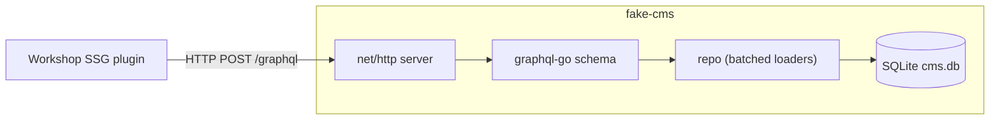

# fake-cms

> A **fake internal CMS GraphQL API** — a SQLite-backed, read-only, deterministic
> mock of a legacy **WordPress + Yoast** media CMS, built to drive a workshop in
> which participants write a **static site generator (SSG) plugin**.

`fake-cms` stands in for a real, private content API the workshop does not have
access to. Its schema is **reverse-engineered from the public site**
(`20minutes-media.com`) and replays a frozen, synthetic dataset through the same
kinds of queries a production SSG would send.

> ⚠️ **FAKE DATA — DO NOT EXPOSE PUBLICLY.** Unauthenticated, read-only, and
> contains synthetic content. Local workshop use only.

---

## Why this exists

A toy API with three flat fields doesn't teach the hard parts of rendering a
real CMS: **cursor pagination**, **nested relationships**, **heterogeneous
content blocks**, **imperfect legacy data**, and the **N+1 query trap**. So the
mock deliberately mirrors a WordPress + Yoast CMS — the platform the real target
runs — with all its legacy texture:

- **One table, many content types** — articles, case studies, studies are all
  "posts", discriminated by a `postType` field.
- **Two taxonomies** — hierarchical `categories` (under `/archives/`) and flat
  `tags` (under `/rubrique/`, *not* `/tag/` — a real legacy URL convention).
- **Blocks, not HTML** — the body is an ordered list of typed
  `ParagraphBlock | HeadingBlock | ImageBlock | …` (a GraphQL **union**), so the
  SSG must implement a renderer per variant. This is the core exercise.
- **A Yoast-style SEO layer** — `title`, `canonical`, `robots`, OpenGraph,
  Twitter, and a `jsonLd` graph the SSG injects verbatim.
- **Dirty legacy data** — an author whose "name" is an email
  (`admin@clic-clic.com`), image-led case studies with a `wordCount` of ~80,
  page templates named like `page-display.php`.

---

## Features

- 🗄️ **SQLite-backed** (pure-Go `modernc.org/sqlite`, no CGO) — one committed,
  deterministic seed file (`testdata/cms.db`).
- 🔎 **Schema-first GraphQL** — the SDL in [`schema.graphql`](schema.graphql) is
  the single source of truth; served over plain `net/http`.
- 🧱 **Block union + interface** — typed content model that makes the SSG
  exercise meaningful.
- ⚡ **N+1-safe** — batched loaders; resolving 20 articles with all
  relationships costs **7 SQL statements**, enforced by a counting test.
- 🔁 **Relay cursor pagination** — stable under insertion.
- 🛠️ **glazed CLI** — `serve`, `seed`, `db query`, plus a rich embedded help
  system (`fake-cms help api-reference`).
- 🧪 **Tested** — repo unit tests, golden GraphQL queries, a full-article render
  test, and an N+1 regression guard.

---

## Quick start

Requirements: **Go 1.25+**.

```bash
git clone <this-repo> fake-cms && cd fake-cms
make build                 # produces ./fake-cms

./fake-cms serve           # serve on :8080  (uses the committed seed)
```

Then open the **GraphiQL playground**: <http://localhost:8080/playground>

Your first query:

```graphql
{
  articles(first: 3) {
    totalCount
    edges {
      node {
        slug
        title
        postType
        publishedAt
        author { slug displayName }
        featuredMedia { url width height }
      }
    }
    pageInfo { endCursor hasNextPage }
  }
}
```

### Regenerate / inspect the database

```bash
./fake-cms seed --path testdata/cms.db     # deterministic (re)seed
./fake-cms db query --path testdata/cms.db \
  --query "SELECT kind, count(*) FROM content_node GROUP BY kind"
# kind    count(*)
# ARTICLE 140
# PAGE    6
```

### Read the docs (offline, in the binary)

```bash
./fake-cms help                 # list all topics
./fake-cms help api-reference   # the full API spec
./fake-cms help quickstart      # 5-minute tutorial
./fake-cms help workshop-ssg    # the SSG plugin contract
```

---

## Architecture

Dependencies point **up only**: nothing in the GraphQL layer imports
`database/sql`; nothing in the repository imports GraphQL.

```
cmd/fake-cms/main.go        glazed Cobra root (serve / seed / db / version / help)
internal/doc                embedded glazed help entries (api-reference, ...)
internal/server             net/http: /graphql · /playground · /healthz · /
internal/graphql            schema-first resolvers · global ids · block union
internal/repo               database/sql → domain structs (batched loaders, N+1-safe)
internal/domain             plain structs (no framework tags)
internal/migrations         embedded SQL (0001_init.sql)
testdata/cms.db             committed deterministic seed (+ content-sha256)
schema.graphql              THE contract — single source of truth
```



---

## Commands

| Command | Purpose |
|---------|---------|
| `fake-cms serve` | Serve the GraphQL API (flags: `--path`, `--addr`). |
| `fake-cms seed` | Create/migrate + deterministically seed the DB (`--path`). |
| `fake-cms db query` | Read-only SQL escape hatch (`--path`, `--query`). |
| `fake-cms version` | Print version + commit. |
| `fake-cms help [topic]` | Browse the embedded help (e.g. `help api-reference`). |

Flags are **section-prefixed** (glazed field sections): the `db` section's
`path` field is `--path`, the `http` section's `addr` field is `--addr`. Run
`fake-cms <command> --help` for exact names.

---

## The content model in one minute

| Concept | GraphQL | Real-site analogue |
|--------|---------|--------------------|
| Content kind | `Article.postType: PostType` | WP custom post types (`best-cases`, `actualites`, …) |
| Body | `Article.blocks: [BlockUnion!]!` | WP block editor (Gutenberg) |
| Hierarchy | `Category.parent`, `Page.parent` | WP term/page parents |
| Tags | `Tag` → render at `/rubrique/<slug>/` | `/rubrique/` on the real site |
| SEO | `Article.seo: SEO!` | Yoast SEO (canonical, OG, JSON-LD) |
| Media | `Media` nodes, referenced by blocks | WP media library |

See `fake-cms help content-model` for the reasoning behind each choice.

---

## Workshop: the SSG plugin contract

Participants build a plugin that walks the API and emits a static site mirroring
the real site's URL conventions:

| Output | URL |
|--------|-----|
| Article | `/<postTypeSlug>/<slug>/` |
| Page | `/<slug>/` |
| Category | `/archives/<slug>/` |
| Tag | `/rubrique/<slug>/` ⚠️ not `/tag/` |
| Author | `/author/<slug>/` |

Acceptance: every article renders, tags live at `/rubrique/`, `seo.jsonLd` is
injected verbatim, all seven block types render distinctly, and a `sitemap.xml`
covers the site. Full spec: `fake-cms help workshop-ssg`.

---

## Testing

```bash
make test                   # all unit + golden tests
go test ./internal/repo -run TestNoNPlus1 -v   # the N+1 guard
```

---

## Project history & design

The full, intern-facing design & implementation guide (with evidence from the
real site, the SDL, the SQLite DDL, decision records, and a phased plan) lives
in the docmgr ticket:

```
ttmp/2026/06/17/FAKE-CMS--*/design-doc/01-fake-cms-graphql-api-design-implementation-guide.md
```

The investigation diary (how the target was researched, every bug hit during
the build) is alongside it under `reference/`.

---

## License

Internal workshop material (go-go-golems).
