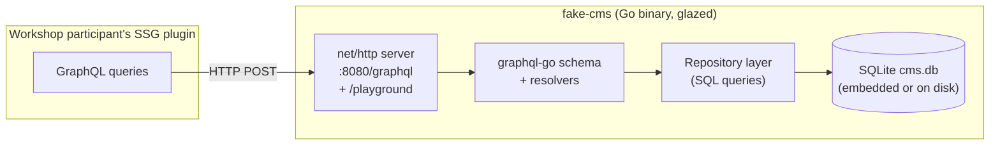
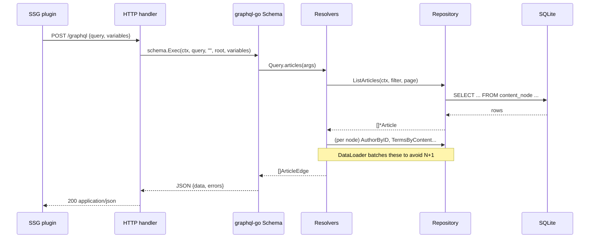

# Fake CMS GraphQL API — Design & Implementation Guide

> **Audience:** a new intern or a workshop participant who has never seen this
> codebase. Read top to bottom. Every claim about the *target* CMS is backed by
> evidence captured in `sources/` (scraped from the real site). Everything
> about *our* mock is a design decision you can challenge in the diary.

---

## 1. Executive summary

We are building a **fake internal Content Management System (CMS) API** whose
job is to *stand in* for a real, legacy, GraphQL content API that we do not have
access to. The real API belongs to a large French media group; its public
marketing/B2B site is `https://www.20minutes-media.com/`. We cannot scrape the
private API, so we **reverse-engineer its shape from the public site** and then
build a **deterministic, SQLite-backed mock** that returns realistic data for
the same kinds of queries.

This mock is the data source for a **workshop**. In the workshop, participants
write a **static site generator (SSG) plugin** that:

1. Connects to the GraphQL endpoint.
2. Pulls articles, authors, taxonomies, and media.
3. Renders them into static HTML pages.

The deliverable you are reading is the **design + implementation guide** for the
mock API itself. It is written for someone who has never worked on this system,
so it explains *what* a CMS is, *what* GraphQL is, *why* the schema looks the
way it does, and *how* to build the Go demo on top of the **glazed** command
framework.

**Key design choices in one paragraph:** The mock is a single Go binary built
with glazed. All content lives in a **single SQLite file** (`cms.db`) that ships
with the binary (embedded via `go:embed`) or is generated on first run. The
GraphQL layer is served over HTTP using the **schema-first `graphql-go`**
library on top of `net/http`. The data model mirrors a **WordPress + Yoast**
CMS because that is what the evidence shows the real target is built on: post
types, pages, categories, tags ("rubriques"), authors, media, and a Yoast-style
SEO layer (slugs, canonicals, OpenGraph, JSON-LD). The content field is modeled
as an **ordered list of typed blocks** (paragraph, heading, image, list, quote,
embed) rather than a raw HTML blob — this is the single most important
"legacy-but-modernizable" detail, and it is what makes the SSG plugin
non-trivial.

### Deliverables of this project

| # | Deliverable | Status |
|---|-------------|--------|
| 1 | This design & implementation guide | draft |
| 2 | GraphQL SDL schema (`schema.graphql`) | designed |
| 3 | SQLite schema + seed data generator | designed |
| 4 | Go demo binary using glazed | designed |
| 5 | Workshop SSG-plugin handoff contract | designed |

---

## 2. Problem statement and scope

### 2.1 The workshop goal

Participants must build an SSG plugin. An SSG plugin typically:

- Reads a **content source** (here: our GraphQL API).
- Walks the content graph (articles → authors → taxonomies → media).
- Emits **static files** (`/article/<slug>/index.html`, `/author/<slug>/index.html`, …).

For the workshop to be realistic, the content source must be **"reasonably
complex" and "mirror a bit of a legacy GraphQL API"** (the user's words). A toy
API with three fields would not teach the hard parts: pagination, nested
relationships, unions/interfaces for heterogeneous blocks, N+1 resolution, and
imperfect legacy naming.

### 2.2 The constraint

We do not have the real API. So we cannot copy its schema. Instead we **infer**
the schema from the only artifact we *can* observe: the **rendered public
website**. Every GraphQL type we design must be justified by something a browser
can see on `20minutes-media.com`.

### 2.3 In scope

- A **read-only** GraphQL Content Delivery API (queries only, no mutations).
- Content types: **Article** (news/study/case-study via post-type), **Page**,
  **Author**, **Category**, **Tag** (rubrique), **Media**.
- **SEO** fields modelled on Yoast (slug, canonical, OG, JSON-LD, meta).
- **Blocks** content model.
- **Pagination**, **filtering**, **ordering**, **nested relationships**.
- A **Go demo binary** (glazed) that serves the API and also exposes CLI
  commands to inspect/seed the SQLite DB.

### 2.4 Out of scope (v1)

- Mutations / write API (the SSG only reads).
- Authentication / authorization (the mock is open; document this loudly).
- Internationalization beyond a single `locale` field (we model the *slot* but
  ship one locale).
- Real-time / subscriptions.
- A web UI. The mock is API-only. (A read-only GraphiQL playground is in scope.)

---

## 3. Glossary

Define terms before using them repeatedly.

- **CMS** — Content Management System. Software that stores editorial content
  (articles, pages, media) and exposes it to front-ends. WordPress is the
  dominant example.
- **WordPress (WP)** — The PHP CMS that the evidence shows the target site runs.
  Its data model (posts, pages, terms, taxonomies, post meta) is the template
  for our mock.
- **Yoast SEO** — The dominant WP SEO plugin. It emits canonical URLs,
  OpenGraph tags, Twitter cards, and **JSON-LD structured data**. We mirror it.
- **Post type** — WP's name for "kind of content". Built-ins: `post`, `page`.
  Custom post types (CPT) on the target: `best-cases`, `actualites`, `etudes`,
  `slider-de-une`. We model a single `Article` GraphQL type with a `postType`
  discriminator plus per-type field availability, because that is how a
  GraphQL façade over WP normally works.
- **Taxonomy / Term** — A grouping mechanism. WP has `category` (hierarchical)
  and `post_tag` (flat). On the target, tags are rendered at `/rubrique/<slug>`.
- **Block** — A typed, ordered unit of content (paragraph, heading, image…).
  Modern WP uses the "block editor" (Gutenberg); the target renders blocks as
  HTML. We model them as a GraphQL **union**.
- **GraphQL** — A query language for APIs where the client selects exactly the
  fields it needs. See §6.
- **SSG** — Static Site Generator. Renders content to HTML at build time.
- **glazed** — The go-go-golems command framework we use for the CLI. See §10.
- **SDL** — Schema Definition Language, the textual format for a GraphQL schema.

---

## 4. Current-state analysis (evidence-based)

> This section is the bridge between "the real site" and "our schema". Every
> sub-section cites a file under `sources/` that an intern can re-run.

### 4.1 What the target actually is

Evidence from `sources/00-sitemap-inventory.md` and `sources/_raw/sitemap-urls.json`:

- The site exposes a **Yoast SEO sitemap index** at `/sitemap.xml`.
- The index lists five sitemaps whose names are **canonical WordPress**:

| Sitemap | WP concept | URLs found |
|---------|-----------|-----------:|
| `post-sitemap.xml` | posts + custom post types | 577 |
| `page-sitemap.xml` | static pages | 39 |
| `category-sitemap.xml` | hierarchical taxonomy | 9 |
| `post_tag-sitemap.xml` | flat taxonomy (rendered as `/rubrique/`) | 38 |
| `author-sitemap.xml` | author archives | 3 |

> **Conclusion:** the target is **WordPress + Yoast SEO**. This is strong
> evidence: the sitemap names are not generic; they are exactly the names Yoast
> generates. We therefore model the mock on the **WordPress data model**, not
> on an invented one.

### 4.2 Content-type breakdown (the post-type segmentation)

From `sources/00-sitemap-inventory.md`, the first path segment of every `post`
URL reveals the **custom post types** in use:

| Segment (CPT) | Count | What it is |
|---------------|------:|-----------|
| `best-cases` | 388 | Advertising/marketing case studies (the bulk of the site) |
| `actualites` | 144 | News / announcements |
| `non-classe` | 33 | Uncategorized |
| `slider-de-une` | 6 | Homepage hero slider items |
| `etudes` | 3 | Audience/studies |
| `blog` | 1 | Blog |
| `cartouches-home` | 1 | Homepage card |

> **Conclusion:** a real query like "list the latest case studies" must filter
> by post type. Our `articles` query therefore takes a `postType` filter, and
> the `Article` type carries a `postType` field. This is the first piece of
> "legacy complexity": the same table holds many logical content types.

### 4.3 The taxonomy surface

- **Categories** live under `/archives/...` (hierarchical; e.g.
  `/archives/actualites/actualites-en-une`).
- **Tags** live under `/rubrique/<slug>` (flat; e.g. `/rubrique/moijeune`,
  `/rubrique/audience`).
- **Authors** live under `/author/<slug>`.

Evidence: `sources/00-sitemap-inventory.md` "Top-level path segments per content
type" plus the per-page `terms` extraction in
`sources/_raw/page-schemas.json`.

> **Conclusion:** our schema needs `Category` (hierarchical, `parent` pointer),
> `Tag` (flat), and `Author`. All three are **nodes** that both *reference*
  articles and are *referenced by* articles (bidirectional edges), which is what
  forces the GraphQL layer to deal with cycles and pagination on relationships.

### 4.4 The SEO layer (Yoast)

From `sources/_raw/page-schemas.json` and `sources/03-article-blocks.md`, every
page emits:

- A `<title>`, meta `description`, `<link rel="canonical">`.
- A full set of `og:*` (OpenGraph) and `twitter:*` meta tags.
- **JSON-LD structured data**. The `@type` inventory across 17 sampled pages:

| JSON-LD `@type` | Occurrences | Maps to GraphQL |
|-----------------|------------:|-----------------|
| `BreadcrumbList` | 17 | `Article.breadcrumbs` / `Page.breadcrumbs` |
| `WebSite` | 17 | site-level config (org, name, url) |
| `ImageObject` | 16 | `Media` node |
| `WebPage` | 11 | `Page` (and base of `Article`) |
| `Person` | 7 | `Author` |
| `Article` | 6 | `Article` |
| `CollectionPage` | 5 | taxonomy/author archive pages |
| `ProfilePage` | 1 | author archive page |

> **Conclusion:** the SEO layer is not optional decoration. Downstream SSG
> rendering depends on `slug`, `canonical`, `seo.title`, `seo.description`,
> `seo.ogImage`, and `seo.jsonLd`. We expose all of these as first-class
> fields.

### 4.5 The resolved Article node (the single best piece of evidence)

From `sources/03-article-blocks.md`, resolving JSON-LD `@id` references on a
real `best-cases` article yields:

```json
{
  "@type": "Article",
  "author": { "name": "admin@clic-clic.com", "@id": ".../schema/person/..." },
  "headline": "Suez Environnement",
  "datePublished": "2013-11-19T11:11:20+00:00",
  "mainEntityOfPage": { "@type": "WebPage", "@id": "...", "url": "..." },
  "wordCount": 80,
  "image": { "@type": "ImageObject", "inLanguage": "fr-FR", "@id": "...#primaryimage" },
  "thumbnailUrl": "https://www.20minutes-media.com/content/uploads/2013/11/vignette-1.jpg",
  "articleSection": ["Best cases"],
  "inLanguage": "fr-FR"
}
```

> **Conclusion:** this *is* the shape of one `Article` row in our DB, almost
> field-for-field. Note the "legacy" warts we deliberately preserve:
> - `author.name` is an email (`admin@clic-clic.com`) — legacy CMS authorship is
>   messy.
> - `wordCount` is tiny (80) for a "case study" — case studies are image-led,
>   so the SSG plugin must handle low-text, media-heavy content.
> - `articleSection` is a human label ("Best cases"), not a slug — the SSG must
>   map labels back to taxonomy terms.

### 4.6 The content body is block-structured

From `sources/03-article-blocks.md`, the body of an `etudes` article decomposes
into an ordered sequence: `group → heading → paragraph → paragraph →
paragraph (image spacer) → …`. Block-type histogram for the samples:

| kind | container | blocks | heading | paragraph | list | embed | images |
|------|-----------|-------:|--------:|----------:|-----:|------:|-------:|
| `etudes` | `div` | 22 | 1 | 19 | 0 | 0 | 4 |
| `actualites` | `div` | 7 | 0 | 5 | 0 | 0 | 0 |
| `best-cases` | `div` | 2 | 0 | 0 | 0 | 0 | 0 |

> **Conclusion:** modelling `content` as `String` (raw HTML) would be the lazy
> choice and the *wrong* choice for an SSG workshop, because it hides the
> interesting work. We model `content` as `[Block!]!` where `Block` is a
> **GraphQL union** of `ParagraphBlock`, `HeadingBlock`, `ImageBlock`,
> `ListBlock`, `QuoteBlock`, `EmbedBlock`, `GalleryBlock`. The SSG plugin must
> render each variant — that is the exercise.

### 4.7 Archives are paginated collections

Categories, tags, and author pages are `CollectionPage`/archive listings
(`sources/02-page-schemas.md`). They list many articles with thumbnails. This
drives the need for **cursor pagination** on list fields.

---

## 5. Gap analysis

| Need (for the workshop) | What the real API gives | What our mock must add | Gap |
|-------------------------|------------------------|------------------------|-----|
| List articles by type | implicit (via CPT URL) | `articles(postType:)` query | schema design |
| Paginate | server-side WP pagination | Relay-style `Connection` | schema design |
| Render body | raw HTML | typed `Block` union | modeling |
| Resolve author | nested `author` ref | `Article.author: Author` | resolver |
| Resolve taxonomy | nested term refs | `Article.categories`, `.tags` | resolver |
| SEO output | Yoast meta/JSON-LD | `seo { ... }` object | modeling |
| Media | `` | `Media` node + `Article.featuredMedia` | modeling |
| Determinism | live data changes | **frozen SQLite seed** | **the mock's whole point** |

The biggest gap is **determinism**: the real site changes daily; the workshop
needs a frozen dataset so exercises have stable expected outputs. **SQLite gives
us that for free** — the seed file is committed.

---

## 6. GraphQL primer (for the intern)

GraphQL is a **typed query language**. The client sends a document selecting
fields; the server returns exactly those fields as JSON. Three operations exist:
`query` (read), `mutation` (write), `subscription` (stream). **We only implement
`query`.**

### 6.1 SDL building blocks we use

- **Scalar**: `String`, `Int`, `Float`, `Boolean`, `ID`, plus custom `DateTime`,
  `JSON`, `URL`.
- **Object type**: `type Article { ... }` — a node with fields.
- **Field with args**: `articles(first: 10, after: $cursor)`.
- **List**: `[Article!]!` — non-null list of non-null articles.
- **Enum**: `enum PostType { ACTUALITES BEST_CASES ETUDES ... }`.
- **Union**: `union Block = ParagraphBlock | HeadingBlock | ...` — a field whose
  value is one of several types; the client uses **inline fragments**
  (`... on HeadingBlock { level text }`) to read it.
- **Interface**: `interface Node { id: ID! }` — a contract many types satisfy.
  We use it so every entity has a stable global `id` (Relay convention).
- **Connection / Edge** (Relay): the standard pagination envelope.

### 6.2 A query the workshop plugin will send

```graphql
query LatestCases($first: Int!, $after: String) {
  articles(postType: BEST_CASES, first: $first, after: $after, orderBy: { field: PUBLISHED_AT, direction: DESC }) {
    edges {
      node {
        id
        slug
        title
        publishedAt
        excerpt
        featuredMedia { url alt width height }
        author { slug displayName avatar { url } }
        categories { slug name }
      }
    }
    pageInfo { endCursor hasNextPage }
  }
}
```

### 6.3 Why schema-first

We choose **schema-first** (write `schema.graphql`, then implement resolvers)
over code-first (generate SDL from Go structs), because:

1. The schema *is* the workshop contract. It must be reviewable in one file.
2. Interns learn GraphQL by reading SDL, not by reading Go struct tags.
3. `graphql-go` supports parsing an SDL directly (`graphql.ParseSchema`).

---

## 7. Proposed GraphQL schema (SDL)

> This is the **single source of truth** for the workshop contract. File:
> `schema.graphql`. Every type below is justified by §4.

```graphql
# schema.graphql — Fake CMS Content Delivery API (read-only)

schema { query: Query }

# ---- Scalars --------------------------------------------------------------
scalar DateTime   # ISO-8601, e.g. "2013-11-19T11:11:20+00:00"
scalar JSON       # opaque JSON (Yoast jsonLd, meta)
scalar URL        # validated absolute URL

# ---- Enums ----------------------------------------------------------------
enum PostType {
  ACTUALITES
  BEST_CASES
  ETUDES
  BLOG
  SLIDER_DE_UNE
  CARTOUCHES_HOME
  NON_CLASSE
}

enum ArticleStatus { DRAFT PUBLISH FUTURE PRIVATE TRASH }

enum OrderField { PUBLISHED_AT MODIFIED_AT TITLE MENU_ORDER }
enum OrderDirection { ASC DESC }

enum MediaKind { IMAGE VIDEO PDF AUDIO FILE }
enum Locale { FR_FR EN_US DE_DE }   # slot only; v1 ships FR_FR

# ---- Node interface (Relay global identity) -------------------------------
interface Node { id: ID! }

# ---- Taxonomy & people ----------------------------------------------------
type Author implements Node {
  id: ID!
  slug: String!
  displayName: String!
  email: String               # legacy: may be a raw email, may be empty
  description: String
  avatar: Media
  locale: Locale!
  articles(first: Int = 10, after: String): ArticleConnection!
}

type Category implements Node {
  id: ID!
  slug: String!
  name: String!
  description: String
  parent: Category            # nullable; root categories have none
  children(first: Int = 10, after: String): CategoryConnection!
  articles(first: Int = 10, after: String): ArticleConnection!
}

type Tag implements Node {
  id: ID!
  slug: String!
  name: String!
  description: String
  articles(first: Int = 10, after: String): ArticleConnection!
}

# ---- Media ----------------------------------------------------------------
type Media implements Node {
  id: ID!
  slug: String!
  kind: MediaKind!
  url: URL!
  alt: String
  width: Int
  height: Int
  mimeType: String
  fileSize: Int
  caption: String
  sourceUrl: URL!             # original (full-res) URL
  locale: Locale!
}

# ---- SEO (Yoast) ----------------------------------------------------------
type SEO {
  title: String!
  metaDescription: String
  canonical: URL
  robots: String              # e.g. "index,follow"
  og: OpenGraph
  twitter: TwitterCard
  jsonLd: JSON                # the raw Yoast JSON-LD graph for the resource
  breadcrumbs: [Breadcrumb!]!
}

type OpenGraph { title: String description: String image: Media type: String locale: String siteName: String }
type TwitterCard { card: String title: String description: String image: Media }
type Breadcrumb { label: String! url: URL! }

# ---- Content blocks (union) ----------------------------------------------
# The body of an Article/Page is an ORDERED list of typed blocks.
interface Block {
  id: ID!
  order: Int!
}
type ParagraphBlock implements Block { id: ID! order: Int! text: String! align: Align }
type HeadingBlock   implements Block { id: ID! order: Int! level: Int! text: String! anchor: String }
type ImageBlock     implements Block { id: ID! order: Int! media: Media! caption: String link: URL size: String }
type ListBlock      implements Block { id: ID! order: Int! ordered: Boolean! items: [String!]! }
type QuoteBlock     implements Block { id: ID! order: Int! text: String! citation: String }
type EmbedBlock     implements Block { id: ID! order: Int! provider: String! url: URL! caption: String }
type GalleryBlock   implements Block { id: ID! order: Int! images: [Media!]! columns: Int }
enum Align { LEFT CENTER RIGHT NONE }
union BlockUnion = ParagraphBlock | HeadingBlock | ImageBlock | ListBlock | QuoteBlock | EmbedBlock | GalleryBlock

# ---- Articles & Pages -----------------------------------------------------
interface Content implements Node {
  id: ID!
  slug: String!
  title: String!
  status: ArticleStatus!
  locale: Locale!
  publishedAt: DateTime
  modifiedAt: DateTime!
  seo: SEO!
  blocks: [BlockUnion!]!      # ordered body
  featuredMedia: Media
}

type Article implements Content & Node {
  id: ID!
  slug: String!
  title: String!
  excerpt: String
  status: ArticleStatus!
  postType: PostType!
  locale: Locale!
  publishedAt: DateTime
  modifiedAt: DateTime!
  author: Author!
  categories: [Category!]!
  tags: [Tag!]!
  featuredMedia: Media
  blocks: [BlockUnion!]!
  seo: SEO!
  wordCount: Int
  related(first: Int = 5): [Article!]!     # same postType + shared tags
}

type Page implements Content & Node {
  id: ID!
  slug: String!
  title: String!
  status: ArticleStatus!
  locale: Locale!
  publishedAt: DateTime
  modifiedAt: DateTime!
  parent: Page
  menuOrder: Int!
  template: String            # e.g. "page-display.php"
  featuredMedia: Media
  blocks: [BlockUnion!]!
  seo: SEO!
}

# ---- Connections (Relay cursor pagination) --------------------------------
type ArticleConnection { edges: [ArticleEdge!]! pageInfo: PageInfo! totalCount: Int! }
type ArticleEdge { node: Article! cursor: String! }
type CategoryConnection { edges: [CategoryEdge!]! pageInfo: PageInfo! totalCount: Int! }
type CategoryEdge { node: Category! cursor: String! }
type PageInfo { hasNextPage: Boolean! hasPreviousPage: Boolean! startCursor: String endCursor: String }

# ---- Top-level Query ------------------------------------------------------
input ArticleOrder { field: OrderField! direction: OrderDirection! = DESC }
input ArticleFilter {
  postType: PostType
  status: ArticleStatus = PUBLISH
  categorySlug: String
  tagSlug: String
  authorSlug: String
  search: String            # legacy: LIKE-based full text
  publishedAfter: DateTime
  publishedBefore: DateTime
}

type Query {
  node(id: ID!): Node
  article(id: ID, slug: String): Article
  page(id: ID, slug: String): Page
  articles(
    filter: ArticleFilter
    first: Int = 20
    after: String
    orderBy: ArticleOrder = {field: PUBLISHED_AT, direction: DESC}
  ): ArticleConnection!
  pages(first: Int = 20, after: String): [Page!]!
  categories(first: Int = 20, after: String): [Category!]!
  category(slug: String!): Category
  tags(first: Int = 20, after: String): [Tag!]!
  tag(slug: String!): Tag
  authors(first: Int = 20, after: String): [Author!]!
  author(slug: String!): Author
  media(id: ID!): Media
  site: Site!
}

type Site {
  name: String!
  description: String
  url: URL!
  locale: Locale!
  logo: Media
  menus: [Menu!]!
}

type Menu { slug: String! name: String! items: [MenuItem!]! }
type MenuItem { label: String! url: URL! order: Int! children: [MenuItem!]! }
```

### 7.1 Why these specific "legacy" shapes

- **`email` on Author can be a raw email** (we saw `admin@clic-clic.com`). We do
  *not* sanitize it; the intern must learn that legacy data is dirty.
- **`search` is LIKE-based**, not full-text. This is realistic for WP and forces
  the SSG to do its own ranking if it cares.
- **`Page.template` is a PHP filename** (`page-display.php`). Deliberately ugly
  — the SSG must map it.
- **`Menu`/`MenuItem`** mirror `wp_nav_menu`, which is how the real nav is
  stored.
- **Unions + interfaces** together: `Block` is an *interface* (so all blocks
  share `id`/`order`) and `BlockUnion` is a *union* used in lists, because some
  GraphQL servers forbid interfaces-in-lists cleanly; the union is the portable,
  teachable choice.

---

## 8. SQLite data model

> File: `migrations/0001_init.sql`. SQLite is chosen because it is a single
> file, needs no server, is deterministic, and the whole org already uses
  `mattn/go-sqlite3` / `modernc.org/sqlite`.

### 8.1 Schema (SQL DDL)

```sql
-- migrations/0001_init.sql
PRAGMA foreign_keys = ON;
PRAGMA journal_mode = WAL;

-- Locale + enums are CHECK-constrained strings for portability.
CREATE TABLE locale ( code TEXT PRIMARY KEY, label TEXT NOT NULL );
INSERT INTO locale VALUES ('fr_FR','Français'), ('en_US','English');

CREATE TABLE post_type (
  slug TEXT PRIMARY KEY,             -- 'best-cases' (WP slug)
  graphql_enum TEXT NOT NULL UNIQUE, -- 'BEST_CASES'
  label TEXT NOT NULL,               -- 'Best cases'
  hierarchical INTEGER NOT NULL DEFAULT 0
);
INSERT INTO post_type VALUES
 ('actualites','ACTUALITES','Actualités',0),
 ('best-cases','BEST_CASES','Best cases',0),
 ('etudes','ETUDES','Études',0),
 ('blog','BLOG','Blog',0),
 ('slider-de-une','SLIDER_DE_UNE','Slider de une',0),
 ('cartouches-home','CARTOUCHES_HOME','Cartouches home',0),
 ('non-classe','NON_CLASSE','Non classé',0);

CREATE TABLE author (
  id INTEGER PRIMARY KEY,
  slug TEXT NOT NULL UNIQUE,           -- WP user_nicename
  display_name TEXT NOT NULL,
  email TEXT,                          -- legacy: may be NULL or an email
  description TEXT,
  avatar_media_id INTEGER REFERENCES media(id),
  locale TEXT NOT NULL DEFAULT 'fr_FR' REFERENCES locale(code)
);

CREATE TABLE media (
  id INTEGER PRIMARY KEY,
  slug TEXT NOT NULL,
  kind TEXT NOT NULL CHECK (kind IN ('IMAGE','VIDEO','PDF','AUDIO','FILE')),
  source_url TEXT NOT NULL,            -- absolute URL
  alt TEXT,
  width INTEGER, height INTEGER,
  mime_type TEXT, file_size INTEGER,
  caption TEXT, locale TEXT NOT NULL REFERENCES locale(code)
);

CREATE TABLE taxonomy (
  slug TEXT PRIMARY KEY,               -- 'category' | 'post_tag'
  label TEXT NOT NULL,
  hierarchical INTEGER NOT NULL
);
INSERT INTO taxonomy VALUES ('category','Categories',1), ('post_tag','Tags',0);

CREATE TABLE term (
  id INTEGER PRIMARY KEY,
  taxonomy_slug TEXT NOT NULL REFERENCES taxonomy(slug),
  slug TEXT NOT NULL,                  -- e.g. 'moijeune'
  name TEXT NOT NULL,
  description TEXT,
  parent_term_id INTEGER REFERENCES term(id),
  UNIQUE(taxonomy_slug, slug)
);

CREATE TABLE content_node (
  id INTEGER PRIMARY KEY,
  kind TEXT NOT NULL CHECK (kind IN ('ARTICLE','PAGE')),
  slug TEXT NOT NULL,
  title TEXT NOT NULL,
  excerpt TEXT,
  status TEXT NOT NULL DEFAULT 'PUBLISH',
  locale TEXT NOT NULL REFERENCES locale(code),
  published_at TEXT,                   -- ISO-8601; nullable for drafts
  modified_at TEXT NOT NULL,
  author_id INTEGER REFERENCES author(id),
  parent_page_id INTEGER REFERENCES content_node(id),
  menu_order INTEGER NOT NULL DEFAULT 0,
  template TEXT,                       -- page template PHP name
  word_count INTEGER,
  UNIQUE(kind, slug)
);

CREATE TABLE article_post_type (
  content_id INTEGER PRIMARY KEY REFERENCES content_node(id),
  post_type TEXT NOT NULL REFERENCES post_type(slug)
);

-- Polymorphic block list (the ordered body). JSON `data` holds block payload.
CREATE TABLE block (
  id INTEGER PRIMARY KEY,
  content_id INTEGER NOT NULL REFERENCES content_node(id),
  order_index INTEGER NOT NULL,
  type TEXT NOT NULL CHECK (type IN
    ('paragraph','heading','image','list','quote','embed','gallery')),
  data JSON NOT NULL,                  -- e.g. {"level":2,"text":"..."}
  UNIQUE(content_id, order_index)
);

CREATE TABLE content_term (            -- M:N content <-> term
  content_id INTEGER NOT NULL REFERENCES content_node(id),
  term_id INTEGER NOT NULL REFERENCES term(id),
  PRIMARY KEY (content_id, term_id)
);

CREATE TABLE content_media (           -- M:N content <-> media (gallery etc.)
  content_id INTEGER NOT NULL REFERENCES content_node(id),
  media_id INTEGER NOT NULL REFERENCES media(id),
  role TEXT,                           -- 'featured' | 'inline' | 'gallery'
  PRIMARY KEY (content_id, media_id, role)
);

-- Yoast-style SEO per content node (1:1).
CREATE TABLE seo (
  content_id INTEGER PRIMARY KEY REFERENCES content_node(id),
  title TEXT NOT NULL,
  meta_description TEXT,
  canonical TEXT,
  robots TEXT DEFAULT 'index,follow',
  og_json JSON,                        -- {title,description,image_id,type,...}
  twitter_json JSON,
  json_ld JSON NOT NULL,               -- the raw graph blob
  breadcrumbs_json JSON NOT NULL
);

CREATE TABLE menu (
  slug TEXT PRIMARY KEY, name TEXT NOT NULL
);
CREATE TABLE menu_item (
  id INTEGER PRIMARY KEY,
  menu_slug TEXT NOT NULL REFERENCES menu(slug),
  parent_id INTEGER REFERENCES menu_item(id),
  label TEXT NOT NULL, url TEXT NOT NULL, order_index INTEGER NOT NULL
);

-- Versioning for schema migrations (simple).
CREATE TABLE schema_version ( version INTEGER PRIMARY KEY, applied_at TEXT NOT NULL );
INSERT INTO schema_version VALUES (1, datetime('now'));
```

### 8.2 Why this shape (decision-style)

- **`content_node` is a polymorphic table** keyed by `kind`. This mirrors WP's
  `wp_posts` (which stores posts, pages, nav items, and revisions in one table)
  and is the *canonical* "legacy" pattern. The intern should recognize it.
- **`block.data` is JSON.** SQLite has first-class JSON (`json_extract`). This
  avoids one table per block type while keeping the data queryable.
- **`seo` is a separate 1:1 table** because it is large and only sometimes
  needed; resolvers `LEFT JOIN` it lazily.
- **Global IDs** are computed, not stored: `base64("Article:<row_id>")`. This is
  the Relay convention and lets `node(id:)` work uniformly.

### 8.3 Seed data strategy

- A generator (`cmd/fake-cms/seed`) fills the DB from the scraped samples in
  `sources/_raw/`, then **expands** them: ~3 authors, ~8 categories, ~30 tags,
  ~200 articles (mix of post types), ~50 media, realistic blocks each.
- The seed is **deterministic** (seeded PRNG) so two runs produce byte-identical
  `cms.db`. This is critical for workshop grading.
- Ship one generated `cms.db` committed in `testdata/cms.db` and also embed it.

---

## 9. System architecture

### 9.1 Component diagram (Mermaid)



### 9.2 Layering (strict)

1. **Storage** — SQLite file + `migrations/`.
2. **Repository** — pure Go, `database/sql` queries, returns domain structs. No
   GraphQL knowledge.
3. **Resolvers** — translate domain structs → GraphQL types, implement
   pagination, compute global IDs. No SQL.
4. **HTTP** — `net/http` handler wrapping `graphql-go`. Plus `/playground`
   (GraphiQL HTML).
5. **CLI (glazed)** — `serve`, `seed`, `db query`, `db schema`, `dump-json`.

> **Rule:** dependencies point **up** only. Resolvers must never import
> `database/sql`; the repository must never import `graphql`. This is what keeps
> the mock testable and teachable.

### 9.3 Request lifecycle (sequence)



---

## 10. The Go demo on glazed

### 10.1 Why glazed

glazed (see `/home/manuel/code/wesen/go-go-golems/glazed/README.md`) gives us,
for free:

- A **Cobra CLI** with consistent flags (`--output json/table/csv`).
- **Field sections** for grouped, validated config (DB path, port, log level).
- **Structured output** so `fake-cms db query` results can be piped to `jq`.
- **Embedded help** so `fake-cms help` is rich.

We use glazed for the *operator* surface (serve, seed, inspect). The GraphQL
HTTP server itself is plain `net/http` — glazed is a CLI framework, not a web
framework.

### 10.2 Repository layout (the file reference an intern needs)

```
fake-cms/
├── go.mod                          # module github.com/go-go-golems/fake-cms
├── schema.graphql                  # §7 — the contract (single source of truth)
├── README.md
├── cmd/
│   └── fake-cms/
│       └── main.go                 # glazed root command, wires subcommands
├── internal/
│   ├── migrations/
│   │   └── 0001_init.sql           # §8 DDL, embedded via go:embed
│   ├── repo/                       # Layer 2: SQL -> domain structs
│   │   ├── repo.go                 # New(db *sql.DB), Migrate, Seed
│   │   ├── articles.go             # ListArticles, GetArticleBySlug
│   │   ├── taxonomy.go             # Terms, Categories tree
│   │   ├── media.go
│   │   └── blocks.go               # LoadBlocks(contentID) []Block
│   ├── domain/                     # plain Go structs (no graphql, no sql tags)
│   │   └── domain.go               # Article, Page, Author, Term, Media, Block...
│   ├── graphql/
│   │   ├── schema.go               # graphql.ParseSchema(schema.graphql, resolvers)
│   │   ├── resolvers.go            # root Query resolvers
│   │   ├── article.go              # Article field resolvers (author, terms, blocks)
│   │   ├── blocks.go               # union/interface block resolvers
│   │   ├── connection.go           # Relay pagination helpers
│   │   └── ids.go                  # toGlobalID / fromGlobalID (base64)
│   ├── server/
│   │   ├── server.go               # http.Handler for /graphql + /playground
│   │   └── playground.html
│   └── cli/
│       ├── serve.go                # glazed GlazeCommand: serve
│       ├── seed.go                 # glazed GlazeCommand: seed
│       └── db.go                   # glazed GlazeCommand: db query/schema
├── testdata/
│   └── cms.db                      # committed, deterministic seed
└── ttmp/...                        # THIS TICKET
```

### 10.3 Key code sketches (pseudocode → real Go)

#### 10.3.1 Root command (glazed wiring)

```go
// cmd/fake-cms/main.go
func main() {
    root := &cobra.Command{Use: "fake-cms"}
    // glazed field sections give us --db, --port, --log-level uniformly
    dbSection := newDBSection()      // fields: db (path, default cms.db)
    root.AddCommand(cli.NewServeCmd(dbSection))   // glazed GlazeCommand
    root.AddCommand(cli.NewSeedCmd(dbSection))
    root.AddCommand(cli.NewDBCmd(dbSection))
    _ = dbSection
    if err := root.Execute(); err != nil { os.Exit(1) }
}
```

`newDBSection` follows the pattern in
`glazed/cmd/examples/config-custom-mapper/main.go`:

```go
func newDBSection() *schema.Section {
    return schema.MustNewSection("db", "Database",
        schema.WithFields(
            fields.New("path", fields.TypeString, fields.WithDefault("cms.db"),
                fields.WithHelp("Path to the SQLite file")),
        ),
    )
}
```

#### 10.3.2 A glazed GlazeCommand (`serve`)

This is the shape every operator subcommand follows. It mirrors the
`DemoBareCommand` pattern in
`glazed/cmd/examples/config-custom-mapper/main.go`.

```go
// internal/cli/serve.go
type ServeCmd struct { *cmds.CommandDescription }

func NewServeCmd(db *schema.Section) (*ServeCmd, error) {
    desc := cmds.NewCommandDescription("serve",
        cmds.WithShort("Serve the fake CMS GraphQL API over HTTP"),
        cmds.WithSections(db,
            schema.MustNewSection("http", "HTTP",
                schema.WithFields(
                    fields.New("addr", fields.TypeString, fields.WithDefault(":8080")),
                )),
        ),
    )
    return &ServeCmd{desc}, nil
}

func (c *ServeCmd) Run(ctx context.Context, v *values.Values) error {
    dbPath, _ := v.GetString("db.path")
    addr, _   := v.GetString("http.addr")
    db, err := repo.Open(ctx, dbPath)        // opens + migrates
    if err != nil { return err }
    defer db.Close()
    r := repo.New(db)
    h, err := server.New(ctx, r)             // builds graphql-go schema + mux
    if err != nil { return err }
    log.Printf("listening on %s", addr)
    return http.ListenAndServe(addr, h)
}
var _ cmds.BareCommand = (*ServeCmd)(nil)
```

#### 10.3.3 Repository (SQL → domain) — the N+1 danger zone

```go
// internal/repo/articles.go
func (r *Repo) ListArticles(ctx context.Context, f ArticleFilter, p Page) ([]*domain.Article, int, error) {
    // 1) build WHERE from filter (postType, status, categorySlug via JOIN, search LIKE...)
    // 2) ORDER BY published_at DESC LIMIT ? OFFSET ?
    // 3) return rows + totalCount (separate COUNT(*))
}

// CRITICAL: do NOT fetch author/terms per-row in a loop. Batch them.
func (r *Repo) AuthorsByContentIDs(ctx context.Context, ids []int64) (map[int64]*domain.Author, error) {
    // SELECT a.* FROM author a JOIN content_node c ON c.author_id=a.id WHERE c.id IN (...)
    // -> map[contentID]author
}
```

#### 10.3.4 Resolvers + DataLoader (defeat N+1)

```go
// internal/graphql/article.go
func (r *articleResolver) Author(ctx context.Context, obj *domain.Article) (*domain.Author, error) {
    return r.loaders.AuthorByID(ctx).Load(obj.AuthorID)  // batched + cached
}
func (r *articleResolver) Blocks(ctx context.Context, obj *domain.Article) ([]graphql.Block, error) {
    raw, err := r.repo.BlocksByContentID(ctx, obj.ID)
    return mapBlocks(raw), err   // switch on type -> ParagraphBlock...
}
// ResolveType for the Block interface & BlockUnion union lives in blocks.go.
```

> **The DataLoader is not optional.** A query fetching 20 articles each with an
> author is 1 + 20 queries without batching. We use
> `github.com/graph-gophers/dataloader` (or a hand-rolled batcher) keyed by ID.

#### 10.3.5 HTTP handler (plain net/http)

```go
// internal/server/server.go
func New(ctx context.Context, r *repo.Repo) (http.Handler, error) {
    schema, err := graphql.ParseSchema(
        embeddedSchemaSDL,                      // go:embed schema.graphql
        &resolvers.Root{Repo: r, Loaders: ...},
        graphql.UseFieldResolvers(),
    )
    if err != nil { return nil, err }
    mux := http.NewServeMux()
    mux.Handle("/graphql", &relay.Handler{Schema: schema})
    mux.Handle("/playground", playgroundHandler())
    mux.HandleFunc("/healthz", func(w http.ResponseWriter, _ *http.Request) { w.Write([]byte("ok")) })
    return logging(mux), nil
}
```

#### 10.3.6 Block mapping (the union resolver)

```go
// internal/graphql/blocks.go
func mapBlock(b domain.Block) (graphql.Block, error) {
    switch b.Type {
    case "paragraph": return &ParagraphBlock{ID: gid("Block", b.ID), Order: b.Order, Text: b.Data.text}, nil
    case "heading":   return &HeadingBlock{...}, nil
    case "image":     return &ImageBlock{Media: resolveMedia(b.Data.mediaID)}, nil
    // ...
    }
}
// ResolveType returns the concrete GraphQL type so the engine can dispatch
// `... on HeadingBlock { level }`.
```

---

## 11. Decision records

### Decision: SQLite over a "real" DBMS

- **Context:** The mock must be deterministic and zero-ops for a workshop.
- **Options considered:** (a) Postgres container, (b) JSON files, (c) SQLite file.
- **Decision:** SQLite single file.
- **Rationale:** No server to start; the seed is one committed file; the whole
  org already depends on `mattn/go-sqlite3`/`modernc.org/sqlite`; SQLite JSON1
  gives us the `block.data` column for free.
- **Consequences:** Single-writer only (fine — read-only API); embed `modernc`
  (pure Go, no CGO) so participants build without a C toolchain. Must validate
  that `modernc.org/sqlite` JSON functions are enabled (they are by default).
- **Status:** accepted

### Decision: schema-first GraphQL with `graphql-go`

- **Context:** The schema is the workshop contract.
- **Options:** (a) `99designs/gqlgen` (codegen), (b) `graphql-go/graphql`
  (runtime, schema-first), (c) `graph-gophers/graphql-go` (struct-tag, SDL).
- **Decision:** `graphql-go/graphql` with `graphql.ParseSchema(SDL)`.
- **Rationale:** Smallest cognitive load for an intern: one `schema.graphql`
  file + resolvers. No `go generate` step. SDL is reviewable in PRs.
- **Consequences:** Less type safety than gqlgen; resolver bugs surface at
  runtime. Mitigate with a golden-file test suite (§12).
- **Status:** accepted

### Decision: GraphQL union + interface for blocks (not JSON scalar)

- **Context:** Modeling the body.
- **Options:** (a) `content: String` raw HTML, (b) `content: JSON`, (c) typed
  `union Block`.
- **Decision:** Typed union (§7).
- **Rationale:** The whole *point* of the workshop is to teach structured
  content rendering. Raw HTML would make the SSG plugin trivial and pointless.
- **Consequences:** More resolver code; interns must use inline fragments.
  Exactly the lesson we want.
- **Status:** accepted

### Decision: Read-only API, no auth

- **Context:** SSG only reads; workshop time is finite.
- **Decision:** Queries only; no auth; document the risk loudly.
- **Consequences:** The mock must never be deployed publicly as-is. Add a
  startup banner: "FAKE DATA — DO NOT EXPOSE".
- **Status:** accepted

### Decision: Relay cursor pagination

- **Context:** Archives are unbounded.
- **Options:** offset/limit vs Relay connections.
- **Decision:** Relay `Connection`/`Edge`/`PageInfo`.
- **Rationale:** It is the de-facto standard the participants will meet in real
  jobs; stable under insertion (cursors, not offsets).
- **Consequences:** More boilerplate; worth it.
- **Status:** accepted

### Decision: global IDs are `base64("Type:rowID")`

- **Context:** `node(id:)` needs a global namespace.
- **Decision:** Relay-style opaque IDs.
- **Ronequence:** `fromGlobalID` must validate the type prefix.
- **Status:** accepted

---

## 12. Test strategy

| Layer | What | How |
|-------|------|-----|
| SQL | migrations apply clean on empty DB | `go test ./internal/repo -run Migrate` |
| Repo | row mapping, filter SQL, counts | table-driven tests against `testdata/cms.db` |
| Resolvers | field selection, union dispatch, pagination math | unit tests calling resolvers directly |
| Schema/E2E | **golden GraphQL queries** → expected JSON | `testdata/queries/*.graphql` + `*.expected.json`; diff with `jq` |
| N+1 | query-level SQL count | wrap `*sql.DB` with a counting driver; assert ≤ N queries for the "20 articles + author" fixture |
| Determinism | seed is stable | hash `cms.db` after seed; compare to committed hash |
| HTTP | `/graphql`, `/playground`, `/healthz` | `httptest` |

**Golden queries are the contract tests.** They are what an intern should read
first after this doc. Example fixture:

```
testdata/queries/list-best-cases.graphql
testdata/queries/list-best-cases.expected.json
```

---

## 13. Phased implementation plan

### Phase 0 — Scaffolding (0.5 day)

1. `go mod init`, add glazed + `graphql-go/graphql` + `modernc.org/sqlite`.
2. Repo layout from §10.2 (empty files + package decls).
3. `cmd/fake-cms/main.go` root cobra command with `--help` working.
4. CI: `go build ./...`, `go test ./...`.

**Exit:** `fake-cms --help` prints subcommands.

### Phase 1 — Storage (1 day)

1. Embed `migrations/0001_init.sql`.
2. `repo.Open` opens SQLite, runs migrations, sets `WAL`/`foreign_keys`.
3. `repo.Seed` generates deterministic data from `sources/_raw`.
4. Commit `testdata/cms.db` + its sha256 in `testdata/cms.db.sha256`.

**Exit:** `fake-cms seed --path /tmp/x.db && sqlite3 /tmp/x.db ".tables"` lists
all tables; re-running yields identical sha256.

### Phase 2 — Repository (1 day)

1. `ListArticles`, `GetArticleBySlug`, `AuthorByID`, `AuthorsByContentIDs`.
2. `TermsByContentID`, `CategoriesTree`, `BlocksByContentID`, `MediaByContentID`.
3. Count query for `totalCount`.
4. Unit tests + counting-driver N+1 test.

**Exit:** repo tests green; N+1 test asserts ≤ 3 queries for a 20-article fetch
with batched authors.

### Phase 3 — GraphQL core (1.5 days)

1. Parse `schema.graphql`.
2. Root resolvers: `article`, `page`, `articles`, `category/tag/author`, `site`.
3. DataLoader wiring.
4. Global ID encode/decode.
5. Golden query fixtures (start with 5).

**Exit:** `fake-cms serve` answers the §6.2 query correctly; 5 golden tests pass.

### Phase 4 — Blocks + SEO (1 day)

1. Union/interface resolvers for all block types.
2. `SEO` resolver from the `seo` table; `jsonLd` passthrough.
3. `featuredMedia`, galleries, embeds.
4. Golden tests for a full article render payload.

**Exit:** an article query returns the complete block tree + SEO, byte-stable.

### Phase 5 — Polish + workshop handoff (0.5 day)

1. `/playground` (embedded GraphiQL), `/healthz`.
2. `fake-cms db query --sql "..."` (glazed structured output).
3. `README.md` quickstart + the workshop "contract" excerpt.
4. Write the SSG-plugin handoff note (what queries to send, pagination rules).

**Exit:** an intern can clone, `make run`, open playground, and start the
workshop.

---

## 14. Workshop handoff: the SSG plugin contract

The plugin the participants build should:

1. **Introspect** the schema (or read `schema.graphql`).
2. Send the paginated `articles` query (§6.2), following `pageInfo.endCursor`
   until `hasNextPage` is false.
3. For each `Article`, also fetch full `blocks` + `seo` (or fetch both in one
   query — preferred).
4. Resolve `author`, `categories`, `tags`, `featuredMedia`.
5. Render:
   - `/<postType>/<slug>/index.html`
   - `/author/<slug>/index.html`
   - `/category/<slug>/index.html` (and `/rubrique/<slug>/` for tags, to mirror
     the real URLs)
   - index/listing pages per post type.
6. Build a sitemap.xml from the slugs (closing the loop with §4.1).

> **Teaching moment:** the real site's tag URLs are `/rubrique/<slug>`, not
> `/tag/<slug>`. The plugin must respect the CMS's URL conventions, not invent
> its own. This is the kind of "legacy detail" the mock exists to surface.

---

## 15. Risks, alternatives, open questions

### Risks

- **R1 — N+1 regressions.** Mitigation: counting-driver test (§12) in CI.
- **R2 — `modernc` JSON quirks.** Validate `json_extract` works on our `data`
  column in the first repo test.
- **R3 — Non-deterministic seed.** PRNG must be seeded; no `time.Now()` in the
  generator (use a fixed `publishedAt` distribution).
- **R4 — Intern confusion at the union/interface split.** Mitigation: a worked
  example in `README.md` and a golden test named `blocks-union.dispatch`.

### Alternatives considered (rejected)

- **gqlgen** — rejected for v1 (codegen adds a step); revisit if the schema grows.
- **Postgres** — rejected (ops cost); see DR SQLite.
- **Raw HTML content** — rejected (kills the exercise); see DR blocks.

### Open questions

- **Q1** Should we model WP **revisions** (`post_parent`)? Probably not for v1;
  leave the `status` field and document that `DRAFT` exists.
- **Q2** Do we need **menus** fully populated, or a single static menu? Seed one
  menu (`main`) for v1.
- **Q3** Multi-locale? Model the slot (`locale`), ship `fr_FR` only.

---

## 16. References

### Source evidence (this ticket)

- `sources/00-sitemap-inventory.md` — sitemap counts + path-segment breakdown
  (proves WordPress + Yoast).
- `sources/_raw/sitemap-urls.json` — all 666 URLs.
- `sources/02-page-schemas.md` + `sources/_raw/page-schemas.json` — per-page
  meta/OG/JSON-LD/body-class extraction.
- `sources/03-article-blocks.md` + `sources/_raw/article-blocks.json` — resolved
  Article schema node + block histograms.
- `sources/01-home.md` — raw home-page markdown for tone/structure.

### Code references (glazed framework)

- `/home/manuel/code/wesen/go-go-golems/glazed/README.md` — command types,
  field sections, help system.
- `/home/manuel/code/wesen/go-go-golems/glazed/cmd/examples/config-custom-mapper/main.go`
  — the `BareCommand` + section pattern our `serve`/`seed` commands copy.
- `/home/manuel/code/wesen/go-go-golems/glazed/pkg/web/static.go` —
  `NewSPAHandler`, the org's `net/http` SPA pattern (no third-party router).
- `/home/manuel/code/wesen/go-go-golems/sqleton/pkg/cmds/spec.go` — the org's
  `SqlCommandSpec` pattern; useful if we later expose `db query` as `.sql` files.

### External

- GraphQL spec & Relay pagination: https://relay.dev/graphql/connections.htm
- `graphql-go/graphql`: https://github.com/graphql-go/graphql
- SQLite JSON1: https://www.sqlite.org/json1.html
- Yoast schema output: https://developer.yoast.com/features/schema/api

### Project files to be created (implementation, §10.2)

- `schema.graphql`, `migrations/0001_init.sql`, `cmd/fake-cms/main.go`,
  `internal/{repo,domain,graphql,server,cli}/...`, `testdata/cms.db`.

---

## 17. TL;DR for the intern

1. The target is **WordPress + Yoast** (proven from its sitemap). Model that.
2. **SQLite** holds everything; one deterministic seed file.
3. **GraphQL** is schema-first (`schema.graphql`), served by `graphql-go` on
   plain `net/http`.
4. **Content is blocks**, not HTML — that is the exercise.
5. **glazed** powers the CLI; the HTTP server is stdlib.
6. Watch the **N+1**; use a DataLoader; assert query counts in CI.
7. Read `sources/03-article-blocks.md` to see the exact Article shape we mirror.
8. Start at Phase 0 and do not skip the golden tests — they *are* the contract.
