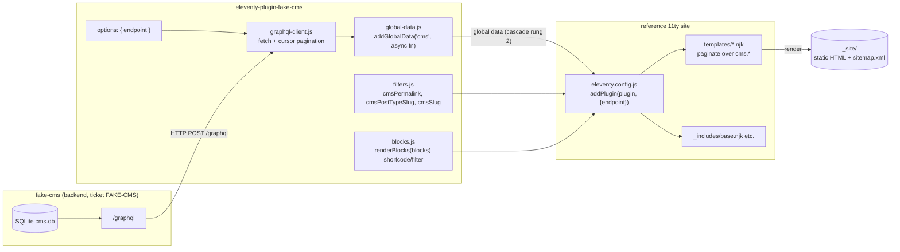
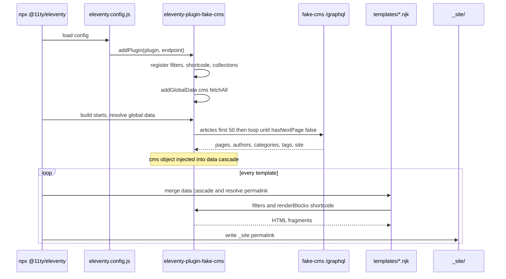

# 11ty Frontend for the Fake CMS — Design & Implementation Guide

> **Audience:** a new intern (or workshop participant) who has never used 11ty
> and has never seen this repo. Read top to bottom. Every claim about how 11ty
> works is backed by a snapshot of the **official Eleventy docs** captured in
> `sources/` (downloaded with `defuddle`). Every claim about what the CMS
> exposes is backed by the backend's `schema.graphql` and the companion ticket
> `FAKE-CMS` (the mock API). Nothing here is invented.

---

## 1. Executive summary

We already have a **fake internal CMS GraphQL API** (ticket `FAKE-CMS`): a
SQLite-backed, read-only, deterministic mock of a legacy WordPress + Yoast media
CMS. It serves articles, pages, authors, categories, tags, and media, with a
**block-structured body** and a **Yoast-style SEO layer**. That API exists to
drive a workshop whose deliverable is a **static site generator (SSG) plugin**.

This ticket is the *other half*: **build that frontend**. Concretely, we will
write a **static website** that consumes the GraphQL API and reproduces the
real target site's content and URL conventions, and we will package the
non-obvious logic as a reusable **Eleventy (11ty) plugin** so the workshop
participants (and future interns) can stand up a working mirror in minutes.

**Why 11ty?** Eleventy is a JavaScript static site generator that is
configuration-light, template-agnostic, and — crucially — lets you feed it data
from *anywhere* (including a GraphQL HTTP API) through its **data cascade**.
It is the right tool here because the CMS already gives us structured JSON, not
Markdown files on disk; 11ty's job is to turn that JSON into a directory of
static HTML.

**The key design choice in one paragraph.** The plugin is a single npm package,
`eleventy-plugin-fake-cms`, that takes one option — the GraphQL `endpoint` —
and does three things: (1) at build time it **fetches all content** from the CMS
(following cursor pagination to the end) and injects it as **global data** in
11ty's data cascade; (2) it registers **filters and a shortcode** that turn the
CMS's typed *block union* into HTML and map GraphQL entities to the legacy URL
conventions; (3) it ships a small, opinionated **set of templates** that paginate
over the fetched collections to emit one page per article, page, category, tag,
and author, plus a homepage and a `sitemap.xml`. The intern owns the templates;
the plugin owns the data plumbing and the block renderer. That separation is what
makes the workshop exercise pedagogically clean.

### Deliverables of this project

| # | Deliverable | Status |
|---|-------------|--------|
| 1 | This design & implementation guide | draft |
| 2 | `eleventy-plugin-fake-cms` npm package (data + filters + block renderer) | designed |
| 3 | A reference 11ty site that uses the plugin and passes acceptance | designed |
| 4 | Workshop handoff: `npx @11ty/eleventy` builds the whole site from `fake-cms serve` | designed |

---

## 2. Problem statement and scope

### 2.1 The goal

Turn a GraphQL content API into a directory of static HTML that faithfully
mirrors the real site. "Faithfully" is defined by the backend ticket's
**workshop-ssg contract** (`fake-cms help workshop-ssg`), which pins five URL
conventions and seven block types. The frontend must reproduce them *exactly*,
because the whole point of the mock is to teach the hard, legacy bits.

### 2.2 The constraint

The CMS never returns HTML. The article body is `[BlockUnion!]!` — an ordered
list of typed blocks (`ParagraphBlock | HeadingBlock | ImageBlock | ListBlock |
QuoteBlock | EmbedBlock | GalleryBlock`). So the frontend cannot "just paste"
content; it must **implement a renderer per variant**. That is the core of the
exercise, and it is non-negotiable: a renderer that falls back to a single
generic template for two block types fails acceptance.

### 2.3 In scope

- A **read-only static site**: the SSG only queries; there are no forms, no auth.
- Every **Article**, **Page**, **Category**, **Tag**, and **Author** rendered to
  its own URL per the convention table (§12).
- A **renderer for all seven block types**, producing distinct markup per type.
- An **SEO `<head>`** driven verbatim by the CMS `seo` object (title, canonical,
  robots, OpenGraph, Twitter, and `jsonLd` injected as-is).
- **Listing/archive pages** for each post type and taxonomy term, paginated.
- A **homepage** curating the latest items per section.
- A **`sitemap.xml`** covering every emitted URL.

### 2.4 Out of scope (v1)

- **Image processing/optimization.** Media is referenced by absolute URL; we do
  not download, resize, or self-host images (the plugin may note `@11ty/eleventy-img`
  as a future enhancement).
- **Client-side interactivity** (search, JS embeds beyond iframes). Embeds render
  as provider iframes; nothing else needs JS.
- **Localization.** The schema has a `locale` slot but ships one locale; we build
  the single-language site.
- **CMS-authored navigation beyond `site.menus`.** We render the menus the CMS
  already gives us; we do not infer new ones.
- **A live preview server.** 11ty's `--serve` is used for dev; production is the
  static `_site/`.

---

## 3. Glossary

Read this once; the rest of the doc assumes it.

**CMS — Content Management System.** A system that stores and serves content.
Here, a **WordPress + Yoast**-style CMS mocked by the `FAKE-CMS` backend. Its
defining quirks: one `posts` table split into "post types", two taxonomies
(categories under `/archives/`, tags under `/rubrique/`), a block editor body,
and a Yoast SEO layer.

**SSG — Static Site Generator.** A build tool that turns *data + templates* into
a folder of static HTML/CSS/JS you can host anywhere (no server runtime needed).
11ty is an SSG. The "site" is just `_site/`.

**11ty / Eleventy.** A JavaScript SSG. Its mental model is tiny: it reads
**input** files (templates) from an input directory, merges each template with
**data** from the *data cascade*, renders, and writes **output** files to
`_site/`. It does **not** bundle JS, compile CSS, or run a server in production.

**Template.** A file in the input dir (`.njk`, `.liquid`, `.md`, `.js`, …) that
becomes one or more output pages. A template can be paginated to produce *many*
pages from one file.

**Layout.** A reusable wrapper template (e.g. a `base.njk` with `<html><head>…
{{ content | safe }}</html>`) that a page template can wrap itself in via the
`layout` data key. Reduces repetition for `<head>`, nav, footer.

**Data cascade.** 11ty merges data for each template from a fixed **precedence
ladder** (lowest → highest): global data files → config global data → directory
data → front matter → **computed data** (highest). Higher rungs win. *This is
where the plugin puts the fetched CMS content* (as global data, the lowest rung
that is still global), so any template can read it but any template can override
it. See §6.3.

**Collection.** A named, ordered list of items (usually templates) built with
`eleventyConfig.addCollection(name, fn)`. We also use the term loosely for
"arrays of CMS entities" living in the data cascade.

**Pagination.** A template feature (`pagination:` front matter) that takes a
dataset and splits it into chunks, rendering the template **once per chunk**.
With `size: 1` and a dynamic `permalink`, one template file emits **one page per
item** — the technique that lets us mirror hundreds of article URLs from a
single `articles.njk`. See §13.

**Permalink.** The output path for a page. Default mirrors the input path; you
override it with a `permalink` data key, which can interpolate data (including
the pagination alias) and run template syntax. *This is how we enforce the
legacy URL conventions.*

**Shortcode / Filter.** Reusable template helpers. A **shortcode** is a tag you
call (``); a **filter** is a pipe (`{{ article |
cmsPermalink }}`). Both are registered in the plugin via `addShortcode` /
`addFilter`.

**Plugin.** A function `function(eleventyConfig) { … }` you register with
`eleventyConfig.addPlugin(fn, options)`. A plugin is *just configuration* — it
can register data, filters, shortcodes, collections, template extensions, and
even more plugins. This whole ticket is "write one plugin". See §8.

**Block union.** A GraphQL `union BlockUnion = ParagraphBlock | HeadingBlock | …`.
The CMS returns each block's concrete type in `__typename`, so the renderer can
`switch` on it. The single most important data structure in this project.

**JSON-LD.** A JSON format for Schema.org structured data that Yoast emits in a
`<script type="application/ld+json">` tag. The CMS hands it to us pre-built in
`seo.jsonLd`; we inject it **verbatim** — never reconstruct it.

---

## 4. Current-state analysis (evidence-based)

> The CMS is built by ticket `FAKE-CMS`. This section summarizes *what it gives
> us*, with evidence, so the frontend design is grounded in the real contract.
> Every field below is queryable today against `fake-cms serve` on `:8080`.

### 4.1 The endpoint and contract

The API is a read-only GraphQL endpoint at `POST http://localhost:8080/graphql`
with a GraphiQL playground at `/playground`. The single source of truth is
`schema.graphql` in the repo root. Evidence: `internal/server/server.go` wires
`/graphql`, `/playground`, `/healthz` on a plain `net/http` mux; `internal/doc/api-reference.md`
documents every field. (See `sources/` in the *backend* ticket for the scrape of
the real `20minutes-media.com` that the schema was reverse-engineered from.)

### 4.2 The content surface (what we render)

| GraphQL root field | Returns | What the frontend does with it |
|--------------------|---------|--------------------------------|
| `articles(filter, first, after, orderBy)` | `ArticleConnection!` | Paginate to exhaustion; emit one page per article + archive pages per `postType`. |
| `page(slug)` | `Page` | Emit `/<slug>/`. |
| `categories(first)` / `category(slug)` | `[Category!]!` / `Category` | Emit `/archives/<slug>/`. |
| `tags(first)` / `tag(slug)` | `[Tag!]!` / `Tag` | Emit **`/rubrique/<slug>/`** (legacy!). |
| `authors(first)` / `author(slug)` | `[Author!]!` / `Author` | Emit `/author/<slug>/`. |
| `site` | `Site!` | Drives the homepage, global `<title>`, nav menus. |

### 4.3 The `PostType` enum and its URL slug

The schema's `enum PostType` is the discriminator that determines an article's
URL prefix. The mapping to the real site's kebab-case path segment (from the
backend's `workshop-ssg` help):

```text
ACTUALITES      -> actualites
BEST_CASES      -> best-cases
ETUDES          -> etudes
BLOG            -> blog
SLIDER_DE_UNE    -> slider-de-une
CARTOUCHES_HOME -> cartouches-home
NON_CLASSE      -> non-classe
```

This is a pure string transform (`SCREAMING_SNAKE` → `kebab-case`), but it is
**load-bearing**: getting it wrong puts every article at the wrong URL. The
plugin centralizes it in one filter (`cmsPostTypeSlug`), §10.4.

### 4.4 The block union (the body)

`Article.blocks` and `Page.blocks` are `[BlockUnion!]!`. Each block carries an
`order: Int!` and the interface fields `id`, plus its own typed fields. The CMS
guarantees the array is ordered by `order`. The seven concrete types and the
distinct markup each must produce are specified in §11. **Evidence:** the
schema's `interface Block { id, order }` plus the `union BlockUnion = …` line in
`schema.graphql`; resolved block histograms in the backend ticket's
`sources/03-article-blocks.md`.

### 4.5 The SEO layer (the `<head>`)

Every `Article`/`Page` has a non-null `seo: SEO!` with: `title`, `metaDescription`,
`canonical`, `robots`, `og: OpenGraph`, `twitter: TwitterCard`, `jsonLd: JSON`
(the raw Yoast graph), and `breadcrumbs: [Breadcrumb!]!`. The frontend's only
correct move is to **emit these verbatim** — especially `jsonLd`, which is
already a complete Schema.org document. Reconstructing it would be a bug.
**Evidence:** the `type SEO { … }` block in `schema.graphql`.

### 4.6 Relationships and the N+1 guardrail

An `Article` links to `author`, `categories`, `tags`, `featuredMedia`, and
`related(first)`. The backend enforces batched loading (its `TestNoNPlus1` proves
20 articles with all relationships resolve in **7 SQL statements**). The lesson
for the frontend: **fetch the full render payload per article in one query**, not
field-by-field. Re-issuing a query per relationship reintroduces N+1 on the
client. The canonical "one-request full render" query shape lives in
`internal/doc/api-reference.md`; we reuse it verbatim in §10.3.

### 4.7 Dirty legacy data we must tolerate

The backend deliberately ships imperfect data (see its README): an author whose
`displayName` is a raw email (`admin@clic-clic.com`), image-led case studies with
`wordCount ≈ 80`, `page.template` values like `"page-display.php"`, and UTF-8
accents inside slugs (`actualités`). The frontend must handle nullables and
accented slugs without crashing the build — the plugin normalizes these rather
than assuming clean input.

---

## 5. Gap analysis

The CMS gives us **data**. A static site needs **files on disk at the right
paths, rendered to HTML**. The gap, item by item:

| Need | Does the CMS provide it? | Who fills the gap |
|------|--------------------------|-------------------|
| A URL for each entity | Partially (slugs; the *convention* is ours) | Plugin filter `cmsPermalink` (§10.4) |
| One HTML page per article/page | No — only JSON | Paginated templates (§13) |
| Block bodies rendered to HTML | No — typed JSON | Plugin block renderer (§11) |
| SEO `<head>` + JSON-LD | Yes, fully | Templates use it verbatim (§14) |
| Listing/archive pages | No — only `articles(filter)` | Paginated templates per section/term (§13) |
| A homepage | `site` config + menus | One template (§13) |
| A `sitemap.xml` | No | One template over the collected URLs (§15) |
| Build orchestration | No | 11ty + the plugin's global data fetch (§8) |

The gap is exactly "data → files". 11ty is the engine; the plugin is the adapter.

---

## 6. Eleventy primer (for the intern)

If you have never used 11ty, this section is the minimum you need. Everything is
backed by the docs snapshots in `sources/`.

### 6.1 The build at a glance

```text
input dir (templates + _data) ──▶ [11ty build] ──▶ _site/  (static HTML)
        ▲                                ▲
   data cascade                  filters / shortcodes
   (merged per template)         (registered by config/plugin)
```

A build is: for each template, **merge its data**, **resolve its `permalink`**,
**render** through its template language, **write** the file. That's it.

### 6.2 Anatomy of an 11ty project

```text
fake-cms-site/
├─ eleventy.config.js        # exports function(eleventyConfig){ … }; registers the plugin
├─ package.json              # deps: @11ty/eleventy + eleventy-plugin-fake-cms
├─ src/                      # input directory
│  ├─ _data/                 # global data files (we don't need these; the plugin supplies data)
│  ├─ _includes/             # layouts and partials (base.njk, head.njk, …)
│  ├─ index.njk              # homepage
│  ├─ articles.njk           # paginated → one page per article
│  ├─ pages.njk              # paginated → one page per Page
│  ├─ archives.njk           # paginated → one page per Category
│  ├─ rubriques.njk          # paginated → one page per Tag (note the name!)
│  ├─ authors.njk            # paginated → one page per Author
│  └─ sitemap.xml.njk        # sitemap
└─ _site/                    # output (gitignored)
```

You run it with `npx @11ty/eleventy` (build) or `npx @11ty/eleventy --serve`
(build + local dev server). Evidence: `sources/18-11ty-config.md`, `sources/17-11ty-programmatic.md`.

### 6.3 The data cascade (where our data lives)

From `sources/13-11ty-data-cascade.md`, the precedence ladder (lowest first):

1. Global Data Files (`_data/*.js`)
2. Configuration API Global Data (`eleventyConfig.addGlobalData`)
3. Directory Data Files
4. Front Matter Data
5. **Computed Data** (`eleventyComputed`, highest)

The plugin injects the CMS content via **`addGlobalData`** (rung 2). Any
template can read it as `cms.articles`, `cms.tags`, etc., and any template can
override a key locally. That is the correct layer: global, but overridable.

### 6.4 Pagination = many pages from one file

From `sources/14-11ty-pagination.md`. Front matter on a single template:

```yaml
---
pagination:
  data: cms.articles
  size: 1
  alias: article
permalink: "/{{ article.postTypeSlug }}/{{ article.slug }}/"
---
<h1>{{ article.title }}</h1>
```

With `size: 1`, 11ty renders this template **once per element** of
`cms.articles`, binding each element to the alias `article`, and writing each to
its computed `permalink`. One file → 140 article pages. This is the hinge of the
whole design.

### 6.5 Plugins are just configuration

From `sources/11-11ty-create-plugin.md`: a plugin is `function(eleventyConfig){…}`
(or an object with a matching shape), registered via
`eleventyConfig.addPlugin(plugin, options)`. Inside it you may call any
`eleventyConfig.*` API. **As of 11ty v3, `addPlugin` is async-aware — if the
plugin function is `async`, `await` the `addPlugin` call.** That matters for us
because our data fetch is async; we resolve it in `addGlobalData` (which already
accepts an async function), so the plugin function itself stays synchronous.

---

## 7. The plugin: two viable shapes (and the one we pick)

There are two honest ways to package this. We pick a hybrid. This is a design
decision, so it is spelled out as a decision record (§16.1) — but the shape is
important enough to motivate up front.

### 7.1 Option A — "data-only" plugin

The plugin exposes *only* global data + filters/shortcodes. The intern writes
every template themselves.

- **Pro:** maximally educational; the intern touches every URL convention.
- **Con:** every workshop participant re-implements the same six paginated
  templates and the same sitemap; easy to get a convention wrong (e.g. `/tag/`
  instead of `/rubrique/`).

### 7.2 Option B — "batteries-included" plugin

The plugin contributes templates too (via `addExtension` custom template
languages or by adding an extra input directory). The intern's site is two lines:
register the plugin, run the build.

- **Pro:** zero boilerplate; conventions enforced centrally.
- **Con:** hides the exercise; the workshop's teaching value (writing the
  renderer, owning the permalinks) evaporates.

### 7.3 What we ship: Option C — "adapter + reference templates"

The npm package is **Option A** (data + filters + block renderer + a GraphQL
client). The **repo also contains a reference 11ty site** (Option B's templates)
that consumes the plugin and passes acceptance. Workshop participants get the
plugin for free (the un-fun plumbing) and are *given* the template set as a
starting point they must read, understand, and may modify. The block renderer
ships in the plugin but is intentionally a single `switch` the intern can study
and extend (§11). This preserves the pedagogy while removing the busywork.

---

## 8. Proposed plugin architecture

### 8.1 Component diagram (Mermaid)



### 8.2 The build lifecycle (sequence)



### 8.3 Layering (strict)

Data flows **one way**: `CMS → graphql-client → global-data → data cascade →
templates → _site`. The block renderer is a **pure function** of a block list;
it never fetches. The filters are pure functions of their arguments. Nothing in
the template layer imports `fetch`. This mirroring of the backend's own strict
layering (`internal/{domain,repo,graphql,server}`) is deliberate and makes each
piece independently testable.

---

## 9. The plugin, file by file

This is the file reference an intern needs. Paths are relative to the
`eleventy-plugin-fake-cms` package root.

### 9.1 `index.js` — the plugin entry point

The exported function is what `addPlugin` calls. It accepts `options` and wires
every capability. Pseudocode → real:

```js
// index.js
const { fetchAll } = require("./lib/global-data.js");
const {
  cmsPermalink, cmsPostTypeSlug, cmsSlug, cmsAbsoluteUrl,
} = require("./lib/filters.js");
const { renderBlocks } = require("./lib/blocks.js");

const DEFAULTS = {
  endpoint: "http://localhost:8080/graphql",
  // Turn a PostType enum value into its URL path segment (§4.3).
  postTypeSlug: defaultPostTypeSlug,
  // Should the plugin also register typed collections? (§13.2)
  registerCollections: true,
};

/**
 * @param {import("@11ty/eleventy").UserConfig} eleventyConfig
 * @param {{ endpoint?: string, postTypeSlug?: (t:string)=>string }} [options]
 */
module.exports = function fakeCmsPlugin(eleventyConfig, options = {}) {
  const opts = { ...DEFAULTS, ...options };
  const postTypeSlug = opts.postTypeSlug;

  // (1) Inject ALL fetched CMS content as global data (cascade rung 2, §6.3).
  //     addGlobalData accepts an async function; 11ty awaits it before building.
  eleventyConfig.addGlobalData("cms", async () => fetchAll(opts.endpoint));

  // (2) Filters — pure, usable in any template.
  eleventyConfig.addFilter("cmsPostTypeSlug", (t) => postTypeSlug(t));
  eleventyConfig.addFilter("cmsPermalink", (entity) => cmsPermalink(entity, postTypeSlug));
  eleventyConfig.addFilter("cmsSlug", cmsSlug);
  eleventyConfig.addFilter("cmsAbsoluteUrl", (path) => cmsAbsoluteUrl(path));

  // (3) The block renderer, exposed BOTH as a filter and a shortcode, so a
  //     template can choose  or
  //     {{ article.blocks | renderBlocks | safe }}.
  eleventyConfig.addFilter("renderBlocks", renderBlocks);
  eleventyConfig.addShortcode("renderBlocks", (blocks) => renderBlocks(blocks));

  // (4) Optional typed collections (§13.2) — convenience for archives.
  if (opts.registerCollections) registerCollections(eleventyConfig);
};

function defaultPostTypeSlug(postType) {
  // ACTUALITES -> actualites ; BEST_CASES -> best-cases
  return String(postType).toLowerCase().replace(/_/g, "-");
}
```

**Why this shape?** It matches the canonical plugin form in
`sources/11-11ty-create-plugin.md` (a function taking `eleventyConfig` plus an
options object), keeps the function synchronous (so plain `addPlugin`, no
`await` needed), and isolates all I/O inside `fetchAll` (returned from
`addGlobalData`'s async resolver). An intern can read top-to-bottom and see the
four jobs of the plugin.

### 9.2 `lib/graphql-client.js` — cursor-paginated fetcher

The single networked module. It speaks one query, follows Relay cursors to the
end, and never re-issues per-field requests.

```js
// lib/graphql-client.js

/**
 * Send one GraphQL document to the CMS.
 * @param {string} endpoint
 * @param {string} query
 * @param {object} [variables]
 * @returns {Promise<any>} the `data` payload (throws on GraphQL errors)
 */
async function gql(endpoint, query, variables = {}) {
  const res = await fetch(endpoint, {
    method: "POST",
    headers: { "content-type": "application/json" },
    body: JSON.stringify({ query, variables }),
  });
  if (!res.ok) throw new Error(`CMS ${res.status}: ${await res.text()}`);
  const json = await res.json();
  if (json.errors?.length) {
    throw new Error("GraphQL errors:\n" + JSON.stringify(json.errors, null, 2));
  }
  return json.data;
}

/**
 * Exhaustively page `articles`, following Relay cursors until hasNextPage=false.
 * (Backend guarantees stable cursors under insertion — see FAKE-CMS repo.)
 */
async function fetchAllArticles(endpoint, fullRenderFragment) {
  const out = [];
  let after = null;
  for (;;) {
    const data = await gql(
      endpoint,
      `query($first:Int!,$after:String){
         articles(first:$first, after:$after){
           totalCount
           edges { cursor node { ${fullRenderFragment} } }
           pageInfo { endCursor hasNextPage }
         }
       }`,
      { first: 50, after }
    );
    for (const edge of data.articles.edges) out.push(edge.node);
    if (!data.articles.pageInfo.hasNextPage) break;   // loop to completion
    after = data.articles.pageInfo.endCursor;
  }
  return out;
}

module.exports = { gql, fetchAllArticles };
```

> **Acceptance hook (§17):** the count of `out` must equal
> `articles(first:0){ totalCount }`. If it does not, we stopped early — a bug.

### 9.3 `lib/global-data.js` — assemble the data cascade payload

`fetchAll` is what `addGlobalData("cms", …)` resolves to. It fans out one query
per root collection, then derives convenience fields.

```js
// lib/global-data.js
const { gql, fetchAllArticles } = require("./graphql-client.js");

// The "one-request full render" fragment — exactly the shape api-reference.md
// documents. Fetching this once per article avoids client-side N+1 (§4.6).
const ARTICLE_FRAGMENT = `
  id slug title excerpt postType publishedAt modifiedAt wordCount
  author { slug displayName }
  categories { slug name }
  tags { slug name }
  featuredMedia { url alt width height }
  blocks { __typename order
    ... on ParagraphBlock { text align }
    ... on HeadingBlock   { level text anchor }
    ... on ImageBlock     { media { url alt width height } caption link }
    ... on ListBlock      { ordered items }
    ... on QuoteBlock     { text citation }
    ... on EmbedBlock     { provider url caption }
    ... on GalleryBlock   { images { url alt width height } columns }
  }
  seo { title metaDescription canonical robots
        og { title description image { url } type locale siteName }
        twitter { card title description image { url } }
        jsonLd
        breadcrumbs { label url } }
`;

async function fetchAll(endpoint) {
  const [articles, pages, categories, tags, authors, site] = await Promise.all([
    fetchAllArticles(endpoint, ARTICLE_FRAGMENT),
    gql(endpoint, `{ pages { slug title template blocks { ${BLOCKS_INLINE} } seo { title canonical jsonLd } } }`).then(d => d.pages),
    gql(endpoint, `{ categories(first:500){ slug name description parent { slug } } }`).then(d => d.categories),
    gql(endpoint, `{ tags(first:500){ slug name description } }`).then(d => d.tags),
    gql(endpoint, `{ authors(first:500){ slug displayName description avatar { url } } }`).then(d => d.authors),
    gql(endpoint, `{ site { name description url locale logo { url } menus { slug name items { label url order children { label url } } } } }`).then(d => d.site),
  ]);
  return { articles, pages, categories, tags, authors, site };
}

module.exports = { fetchAll, ARTICLE_FRAGMENT };
```

The returned object becomes the global `cms` data. A template reads
`cms.articles`, `cms.site.menus`, etc. **This is the entire integration
surface between plugin and site.**

### 9.4 `lib/filters.js` — URL conventions, centralized

The single source of truth for "where does this entity live?". Keep all URL
rules here so no template can invent a wrong convention.

```js
// lib/filters.js
const { cmsAbsoluteUrl } = require("./url.js");

/** Article -> /<postTypeSlug>/<slug>/ ; Page -> /<slug>/ ; Tag -> /rubrique/<slug>/ ; … */
function cmsPermalink(entity, postTypeSlug) {
  if (!entity || !entity.slug) return null;
  switch (entity.__kind) {
    case "Article": return `/${postTypeSlug(entity.postType)}/${entity.slug}/`;
    case "Page":     return `/${entity.slug}/`;
    case "Category": return `/archives/${entity.slug}/`;
    case "Tag":      return `/rubrique/${entity.slug}/`;   // LEGACY: not /tag/
    case "Author":   return `/author/${entity.slug}/`;
    default: return null;
  }
}

const cmsSlug = (s) => encodeURIComponent(String(s ?? ""));

module.exports = { cmsPermalink, cmsSlug, cmsAbsoluteUrl };
```

> **Trick the intern must know:** in pagination templates the alias already *is*
  the entity, so the `__kind` is supplied by the template's front matter (one
  paginated template per kind — §13). `cmsPermalink` is still useful for
  cross-linking (e.g. an article's tags → `/rubrique/<slug>/`).

### 9.5 `lib/blocks.js` — the core exercise

A pure `switch` over `__typename`. Distinct markup per branch is **acceptance
criterion #4**. See §11 for the full table; the file is essentially that table.

### 9.6 The reference site's `eleventy.config.js`

```js
// eleventy.config.js
const fakeCms = require("eleventy-plugin-fake-cms");

module.exports = function (eleventyConfig) {
  eleventyConfig.addPlugin(fakeCms, {
    endpoint: process.env.CMS_ENDPOINT || "http://localhost:8080/graphql",
  });
  eleventyConfig.setInputDirectory("src");
  eleventyConfig.setLayoutsDirectory("src/_includes");
  return { templateFormats: ["njk", "xml", "html"] };
};
```

That's the whole site config. The plugin does the rest.

---

## 10. Key code sketches (pseudocode → real)

### 10.1 Fetch loop (cursor pagination) — summary

```text
after = null
articles = []
loop:
  page = gql(articles(first:50, after))
  articles += page.edges.map(e => e.node)
  if not page.pageInfo.hasNextPage: break
  after = page.pageInfo.endCursor
assert articles.length == gql(articles(first:0)).totalCount   # N+1 / drop guard
```

### 10.2 Data → templates (the binding)

```text
for kind in [Article, Page, Category, Tag, Author]:
  one template file paginates size:1 over cms.<kind>s
  permalink = cmsPermalink(entity)
  render layout(base) with { entity, html: renderBlocks(entity.blocks) }
```

### 10.3 The "one-request full render" query (do not split this)

This is the single query that must travel per article. Splitting it into
per-relationship queries reintroduces client-side N+1 (§4.6). The fragment in
§9.3 is its concrete form; the abstract shape is:

```text
article(slug) {
  id slug title excerpt postType publishedAt wordCount
  author { slug displayName }
  categories { slug name }
  tags { slug name }
  featuredMedia { url alt width height }
  blocks { __typename order …(inline fragments per type) }
  seo { title canonical robots og {…} twitter {…} jsonLd breadcrumbs {…} }
}
```

### 10.4 PostType → URL slug

```text
SCREAMING_SNAKE_CASE  --lowercase-->  screaming_snake_case  --_ --> -  ==  screaming-snake-case
```

Implementation: `s.toLowerCase().replace(/_/g, "-")`. Centralized in
`defaultPostTypeSlug` so an override is a one-line change.

---

## 11. Block rendering — the core of the exercise

The renderer is a `switch` on `block.__typename`. **Every branch must produce
visually distinct, semantic markup**; falling through to a generic case fails
acceptance. This table is the spec — implement it literally, then ship.

| `__typename` | Inputs | Output (HTML) |
|--------------|--------|---------------|
| `ParagraphBlock` | `text`, `align?` | `<p class="align-LEFT\|…">{{ text }}</p>` |
| `HeadingBlock` | `level`, `text`, `anchor?` | `<h{{level}} id="{{anchor}}">{{ text }}</h{{level}}>` |
| `ImageBlock` | `media{url,alt,width,height}`, `caption?`, `link?` | `<figure><a href="{{link}}"></a><figcaption>{{caption}}</figcaption></figure>` |
| `ListBlock` | `ordered`, `items[]` | `<ul\|ol><li>{{i}}</li></…>` |
| `QuoteBlock` | `text`, `citation?` | `<blockquote><p>{{text}}</p><cite>{{citation}}</cite></blockquote>` |
| `EmbedBlock` | `provider`, `url`, `caption?` | provider-specific `<iframe>` (YouTube/Twitter/Vimeo), wrapped in `<figure>` |
| `GalleryBlock` | `images[]`, `columns?` | `<ul class="gallery cols-{{columns}}">……</ul>` |

Pseudocode for `renderBlocks`:

```text
function renderBlocks(blocks):
    html = ""
    # blocks are pre-sorted by order by the CMS, but sort defensively
    for b in stableSort(blocks, by=order):
        html += renderOne(b)
    return html

function renderOne(b):
    switch b.__typename:
        "ParagraphBlock" -> "<p" + alignClass(b.align) + ">" + esc(b.text) + "</p>"
        "HeadingBlock"   -> "<h" + b.level + anchorAttr(b.anchor) + ">" + esc(b.text) + "</h" + b.level + ">"
        "ImageBlock"     -> figure(img(b.media), b.caption, b.link)
        "ListBlock"      -> list(b.ordered ? "ol" : "ul", b.items)
        "QuoteBlock"     -> "<blockquote><p>" + esc(b.text) + "</p>" + cite(b.citation) + "</blockquote>"
        "EmbedBlock"     -> embed(b.provider, b.url, b.caption)
        "GalleryBlock"   -> gallery(b.images, b.columns)
        else             -> "<!-- unknown block: " + b.__typename + " -->"  # FAIL acceptance if hit
```

Real JS skeleton:

```js
// lib/blocks.js
const esc = (s) => String(s ?? "").replace(/[&<>"]/g, (c) =>
  ({ "&":"&amp;", "<":"&lt;", ">":"&gt;", '"':"&quot;" }[c]));

function renderBlocks(blocks = []) {
  return [...blocks]
    .sort((a, b) => (a.order ?? 0) - (b.order ?? 0))
    .map(renderOne)
    .join("\n");
}

function renderOne(b) {
  switch (b.__typename) {
    case "ParagraphBlock":
      return `<p class="align-${b.align ?? "NONE"}">${esc(b.text)}</p>`;
    case "HeadingBlock":
      return `<h${b.level}${b.anchor ? ` id="${esc(b.anchor)}"` : ""}>${esc(b.text)}</h${b.level}>`;
    case "ImageBlock": {
      const m = b.media ?? {};
      const img = ``;
      const inner = b.link ? `<a href="${esc(b.link)}">${img}</a>` : img;
      return b.caption ? `<figure>${inner}<figcaption>${esc(b.caption)}</figcaption></figure>` : inner;
    }
    case "ListBlock": {
      const tag = b.ordered ? "ol" : "ul";
      return `<${tag}>${b.items.map((i) => `<li>${esc(i)}</li>`).join("")}</${tag}>`;
    }
    case "QuoteBlock":
      return `<blockquote><p>${esc(b.text)}</p>` +
             (b.citation ? `<cite>${esc(b.citation)}</cite>` : "") + `</blockquote>`;
    case "EmbedBlock":
      return `<figure class="embed embed-${esc(b.provider)}">${providerEmbed(b.provider, b.url)}` +
             (b.caption ? `<figcaption>${esc(b.caption)}</figcaption>` : "") + `</figure>`;
    case "GalleryBlock":
      return `<ul class="gallery cols-${b.columns ?? 3}">` +
             (b.images ?? []).map((m) =>
               `<li></li>`).join("") + `</ul>`;
    default:
      // Acceptance: this MUST never fire. Surface it loudly during build.
      throw new Error(`Unknown block type: ${b.__typename}`);
  }
}

function providerEmbed(provider, url) {
  // Minimal: YouTube/oEmbed -> iframe. Extend per provider as needed.
  if (/youtube|youtu\.be/i.test(provider)) return `<iframe src="${esc(url)}" allowfullscreen></iframe>`;
  return `<a href="${esc(url)}">${esc(url)}</a>`; // safe fallback for unknown providers
}

module.exports = { renderBlocks, renderOne };
```

**The `unknown block` branch must throw.** Silently rendering nothing hides the
bug; acceptance (#4) explicitly requires all seven types to render distinctly.
A thrown error fails the build loudly during the workshop — exactly what you want.

---

## 12. URL conventions and permalinks (non-negotiable)

Reproduced from `fake-cms help workshop-ssg`. The plugin's `cmsPermalink`
(§9.4) encodes this; each template's `permalink` front matter uses it.

| Entity | Output path | Source |
|--------|-------------|--------|
| Article | `/<postTypeSlug>/<slug>/index.html` | `article.slug` + `cmsPostTypeSlug(postType)` |
| Page | `/<slug>/index.html` | `page.slug` |
| Category archive | `/archives/<slug>/index.html` | `category.slug` |
| Tag archive | `/rubrique/<slug>/index.html` | `tag.slug` (**NOT** `/tag/`) |
| Author | `/author/<slug>/index.html` | `author.slug` |

The `/rubrique/` detail is a **real legacy convention** on the target
(`20minutes-media.com`). Evidence: backend `sources/00-sitemap-inventory.md`.
Getting it wrong is the #1 workshop failure; the plugin name is `rubriques.njk`
precisely so the convention is unmissable.

---

## 13. Templates: paginating the fetched data

### 13.1 The article template (one page per article)

`src/articles.njk`:

```yaml
---
pagination:
  data: cms.articles
  size: 1
  alias: article
permalink: "/{{ article.postType | cmsPostTypeSlug }}/{{ article.slug | cmsSlug }}/"
layout: base.njk
eleventyComputed:
  title: "{{ article.seo.title }}"
---
<article>
  <h1>{{ article.title }}</h1>
  <p class="meta">By <a href="/author/{{ article.author.slug }}/">{{ article.author.displayName }}</a>
     · {{ article.publishedAt | dateToISO }}</p>
        {# the core exercise, delegated to the plugin #}
  <nav class="tags">
    
      <a href="/rubrique/{{ t.slug }}/">{{ t.name }}</a>
    
  </nav>
</article>
```

The other "one page per entity" templates (`pages.njk`, `archives.njk`,
`rubriques.njk`, `authors.njk`) are structurally identical: same front matter
shape, different `data` source, different `permalink`.

### 13.2 Archive pages (paginated listings)

Each section needs a paginated index. Use 11ty's `size: N` pagination over a
**collection** of articles grouped by post type, or build the groups in the
plugin via `addCollection`:

```js
// inside index.js — registerCollections()
const POST_TYPES = ["ACTUALITES","BEST_CASES","ETUDES","BLOG","SLIDER_DE_UNE","CARTOUCHES_HOME","NON_CLASSE"];
function registerCollections(eleventyConfig) {
  for (const pt of POST_TYPES) {
    const name = "pt_" + pt.toLowerCase();
    eleventyConfig.addCollection(name, (collectionApi) => {
      const cms = collectionApi.getAll()[0]?.data?.cms;   // global data is reachable
      return (cms?.articles ?? []).filter((a) => a.postType === pt);
    });
  }
}
```

An archive template then paginates `pt_best_cases` with `size: 12` and a
`/best-cases/page-{{ pagination.pageNumber + 1 }}/` permalink (page 1 at
`/best-cases/`). Evidence for the dynamic-page-number permalink idiom:
`sources/14-11ty-pagination.md` (`permalink: "different/page-{{ pagination.pageNumber + 1 }}/index.html"`).

### 13.3 Homepage

`src/index.njk` curates the latest items per section directly from `cms`:

```yaml
---
layout: base.njk
title: "{{ cms.site.name }}"
---

<h1>{{ cms.site.name }}</h1>

  <a href="{{ a | cmsPermalink }}">{{ a.title }}</a>

```

### 13.4 The page-per-entity pattern recap

```text
one .njk file  +  pagination{ size:1, data: cms.<kind>s, alias: e }  +  permalink: cmsPermalink(e)
        ─────────────────────────────────────────────────────────────────────────────────▶  N output pages
```

That one line is the whole "how do we emit hundreds of pages from a GraphQL API"
answer. It is worth memorizing.

---

## 14. The `<head>`: SEO, verbatim

The layout's `<head>` is driven entirely by `seo`. **Inject `jsonLd` as-is.**

```html
<!-- _includes/head.njk -->
<title>{{ seo.title }}</title>
<meta name="description" content="{{ seo.metaDescription }}">
<link rel="canonical" href="{{ seo.canonical }}">
<meta name="robots" content="{{ seo.robots }}">

  <meta property="og:title" content="{{ seo.og.title }}">
  <meta property="og:description" content="{{ seo.og.description }}">
  <meta property="og:image" content="{{ seo.og.image.url }}">
  <meta property="og:type" content="{{ seo.og.type }}">


  <meta name="twitter:card" content="{{ seo.twitter.card }}">
  <meta name="twitter:title" content="{{ seo.twitter.title }}">

{# THE KEY LINE: inject the Yoast graph verbatim, do not reconstruct it #}
<script type="application/ld+json">{{ seo.jsonLd | safe }}</script>
```

`seo` is non-null (`SEO!`), but individual sub-fields are nullable — guard each.
Evidence: the `type SEO { … }` block in `schema.graphql`.

---

## 15. Sitemap

`src/sitemap.xml.njk` emits one `<url>` per collected permalink. Because every
URL is a function of an entity, the sitemap is just the union of the paginated
collections. Pseudocode:

```text
urls = []
for a in cms.articles:  urls.push(cmsPermalink(a, postTypeSlug))
for p in cms.pages:     urls.push("/" + p.slug + "/")
for c in cms.categories: urls.push("/archives/" + c.slug + "/")
for t in cms.tags:      urls.push("/rubrique/" + t.slug + "/")
for u in cms.authors:   urls.push("/author/" + u.slug + "/")
write urls to /sitemap.xml
```

```xml
<?xml version="1.0" encoding="UTF-8"?>
<!-- src/sitemap.xml.njk ; permalink: /sitemap.xml ; pagination over a flattened list -->
<urlset xmlns="http://www.sitemaps.org/schemas/sitemap/0.9">

  <url><loc>{{ cms.site.url }}{{ u }}</loc></url>

</urlset>
```

`cms.allUrls` is a convenience the plugin can compute in `fetchAll` so the
sitemap template stays trivial. Acceptance (#5): the sitemap count must equal
`articles.totalCount + pages + categories + tags + authors`.

---

## 16. Decision records

### 16.1 Decision: ship an "adapter + reference templates" plugin (Option C)

- **Context:** §7. Two honest shapes (data-only vs batteries-included) trade
  pedagogy against convenience.
- **Options:** A (data-only), B (batteries-included), C (hybrid).
- **Decision:** C — the npm package is data + filters + block renderer; the repo
  ships a reference site that owns the templates.
- **Rationale:** keeps the URL-convention and renderer exercises visible (A's
  strength) while removing the fetch/pagination boilerplate (B's strength).
- **Consequences:** the package is reusable beyond the workshop; the reference
  site is the acceptance harness.

### 16.2 Decision: inject CMS content via `addGlobalData` (cascade rung 2)

- **Context:** where does fetched data live? (§6.3)
- **Options:** `_data/cms.js` file (rung 1) vs `addGlobalData` (rung 2) vs
  per-template fetch (rejected — N+1).
- **Decision:** `addGlobalData("cms", fetchAll)`.
- **Rationale:** the plugin owns fetching; the site config stays minimal; data is
  global but any template may override a key. Per-template fetching would
  re-query the CMS N times (client-side N+1, §4.6).
- **Status:** accepted.

### 16.3 Decision: one-request full render per article, cursor-paginated

- **Context:** how to fetch without N+1 (§4.6, §10.3)?
- **Decision:** page `articles(first:50)` to exhaustion, each edge carrying the
  full render fragment (author, taxonomies, media, blocks, seo) in one query.
- **Rationale:** mirrors the backend's own batching (7 SQL ops for 20 articles).
  Splitting per relationship reintroduces N+1 on the client.

### 16.4 Decision: `renderBlocks` throws on unknown `__typename`

- **Context:** §11. The schema is a `union`; a new type could appear.
- **Decision:** throw (fail the build) rather than silently emit nothing.
- **Rationale:** acceptance #4 requires all seven types to render distinctly; a
  silent skip would mask a missing branch. A loud failure is a teaching moment.

### 16.5 Decision: tags render at `/rubrique/`, enforced by name and filter

- **Context:** §12. The legacy convention is `/rubrique/`, not `/tag/`.
- **Decision:** `cmsPermalink` hard-codes `/rubrique/`; the template file is
  named `rubriques.njk`.
- **Rationale:** this is the single most-missed convention in the workshop
  (backend `workshop-ssg` troubleshooting table). Centralizing it removes the
  class of bug.

### 16.6 Decision: use `@11ty/eleventy-fetch` for response caching (future)

- **Context:** every build currently hits the CMS over HTTP.
- **Options:** re-fetch every build vs cache with `@11ty/eleventy-fetch`.
- **Decision (proposed):** add an opt-in `cache: true` that wraps `gql()` with
  `eleventy-fetch` (deduplicated, disk-cached, TTL-based).
- **Status:** proposed (Phase 3). Documented so an intern can implement it
  without rediscovering the API.

---

## 17. Test strategy

The plugin has no runtime in production (it's a build-time adapter), so tests
are **build-time integration tests** driven by 11ty's programmatic API
(`sources/17-11ty-programmatic.md`).

### 17.1 Programmatic build test

```js
// test/build.test.js
const { Eleventy } = require("@11ty/eleventy");
const path = require("node:path");

test("build emits one article page per CMS article", async () => {
  const elev = new Eleventy("./src", "./_site", {
    config(cfg) { cfg.addPlugin(require(".."), { endpoint: CMS_ENDPOINT }); },
  });
  const json = await elev.toJSON();                       // build, return results
  const htmlPages = json.filter((p) => p.url.endsWith("/"));
  // Cross-check against the CMS's own totalCount.
  const { totalCount } = await gqlTotalCount(CMS_ENDPOINT);
  const articlePages = htmlPages.filter((p) => /\/(actualites|best-cases|etudes|…)\/[^/]+\/$/.test(p.url));
  expect(articlePages.length).toBe(totalCount);           // acceptance #1
});
```

### 17.2 Acceptance criteria → tests (the workshop contract, automated)

| # | Acceptance (from `workshop-ssg`) | Test |
|---|----------------------------------|------|
| 1 | Every article has a static page at the right URL. | Article-page count == `articles.totalCount`; each URL matches `/<postTypeSlug>/<slug>/`. |
| 2 | Tags live at `/rubrique/<slug>/`, not `/tag/`. | Assert no `/tag/` URLs exist; assert a tag URL resolves for each `cms.tags`. |
| 3 | `seo.jsonLd` injected verbatim. | Grep each article's HTML for `<script type="application/ld+json">` whose content `JSON.parse`s to the same object the CMS returned. |
| 4 | All seven block types render distinctly. | Render each block type in isolation; assert seven distinct outer-HTML shapes; assert `renderBlocks` throws on an unknown type. |
| 5 | `sitemap.xml` covers all pages. | sitemap `<loc>` count == totalCount + pages + categories + tags + authors. |
| 6 | Builds from `fake-cms serve` with no manual data. | E2E: start `fake-cms serve`, run `npx @11ty/eleventy`, assert exit 0 and non-empty `_site/`. |

### 17.3 Unit tests for pure pieces

`renderBlocks`, `cmsPermalink`, `defaultPostTypeSlug` are pure → fast unit tests,
including the dirty-data cases (null `caption`, accented slug, email-shaped
`displayName`). No network, no 11ty.

---

## 18. Phased implementation plan

### Phase 0 — Scaffold (0.5 day)
- `npm init`, add `@11ty/eleventy` (v3) and `vitest`. Empty `eleventy.config.js`.
- Reference site skeleton: `src/_includes/base.njk`, `src/index.njk`.
- Smoke build against a hardcoded `_data/cms.js` that returns one fake article.

### Phase 1 — The GraphQL client (0.5 day)
- `lib/graphql-client.js`: `gql()` + `fetchAllArticles()` (cursor loop).
- Guard test: fetched count == `totalCount`.

### Phase 2 — The plugin core (1 day)
- `index.js`, `lib/global-data.js` (`fetchAll`), `addGlobalData("cms", …)`.
- `lib/filters.js` (`cmsPermalink`, `cmsPostTypeSlug`, `cmsSlug`).
- Wire `articles.njk` + `base.njk` + `head.njk`; first end-to-end article pages.

### Phase 3 — Block renderer + SEO (1 day)
- `lib/blocks.js` (all seven branches + throw-on-unknown).
- `head.njk` driven by `seo` (verbatim `jsonLd`).
- Block unit tests; SEO grep test.

### Phase 4 — Taxonomy, authors, homepage, archives (1 day)
- `archives.njk`, `rubriques.njk`, `authors.njk`, `pages.njk`.
- `registerCollections` + paginated archive index pages.
- Homepage curation.

### Phase 5 — Sitemap + caching + polish (0.5 day)
- `sitemap.xml.njk`; sitemap count test.
- Opt-in `@11ty/eleventy-fetch` caching (Decision 16.6).
- README; E2E test against `fake-cms serve`; finalize diary.

**Total: ~4.5 days for an intern** with this guide.

---

## 19. Risks, alternatives, open questions

### Risks
- **Tag-URL regression:** a careless refactor puts tags at `/tag/`. Mitigation:
  Decision 16.5 + an automated test (#2).
- **Client-side N+1:** splitting the full-render query. Mitigation: Decision 16.3
  + a "one query per article" assertion in tests.
- **Unknown block type** shipped by a future schema change silently skipped.
  Mitigation: Decision 16.4 (throw).
- **Accented UTF-8 slugs** break permalinks on some hosts. Mitigation:
  `cmsSlug` encodes; test with `actualités`.
- **Large datasets** make every build slow. Mitigation: Phase 5 caching.

### Alternatives considered (rejected)
- **Gatsby/Next.js:** heavier, opinionated about data sources, and their
  GraphQL-client abstractions obscure the N+1 teaching point. 11ty keeps the
  HTTP fetch explicit.
- **Astro:** excellent, but its component model adds a second conceptual layer
  (islands) the workshop does not need.
- **Per-template fetching** instead of `addGlobalData`: rejected (client N+1).

### Open questions
- Should the plugin download and self-host images (via `@11ty/eleventy-img`) for
  offline workshop use? Currently out of scope (§2.4); revisit if the workshop
  loses internet.
- Should we render `related(first)` as an "article footer" block? The data is
  fetched; the markup is undecided.

---

## 20. References

### 20.1 Source evidence (this ticket, `sources/`)
Downloaded 2026-06-17 with `defuddle` from the official Eleventy docs:

- `sources/10-11ty-plugins.md` — Plugins overview (`external-url: 11ty.dev/docs/plugins/`).
- `sources/11-11ty-create-plugin.md` — **The plugin author contract.**
- `sources/12-11ty-custom-templates.md` — `addExtension`/`compile`/`getData`.
- `sources/13-11ty-data-cascade.md` — **Cascade precedence ladder.**
- `sources/14-11ty-pagination.md` — **`size:1` + dynamic permalink = N pages.**
- `sources/15-11ty-collections.md` — `addCollection`.
- `sources/16-11ty-js-data-files.md` — async functions as data.
- `sources/17-11ty-programmatic.md` — **`new Eleventy(); await elev.write()`.**
- `sources/18-11ty-config.md` — `addGlobalData`/`addFilter`/`addShortcode`.

### 20.2 The CMS contract (ticket `FAKE-CMS`, this repo)
- `schema.graphql` — the single source of truth (every type/field above).
- `internal/doc/api-reference.md` — per-field API + the full-render query shape.
- `internal/doc/workshop-ssg.md` — **the acceptance criteria** (§12, §17.2).
- `internal/server/server.go` — endpoint wiring (`/graphql`, `/playground`).
- `internal/graphql/blocks.go` — the block union resolver (mirrors §11).

### 20.3 External
- Eleventy home: https://www.11ty.dev/
- `@11ty/eleventy-fetch` (caching): https://www.11ty.dev/docs/plugins/fetch/
- `@11ty/eleventy-img` (future image work): https://www.11ty.dev/docs/plugins/image/

---

## 21. TL;DR for the intern

1. The backend (`FAKE-CMS`) is a read-only GraphQL CMS. The frontend is a static
   site. 11ty turns the former into the latter.
2. You are writing **one plugin**, `eleventy-plugin-fake-cms`, plus a reference
   site that uses it. The plugin: fetches everything once (`addGlobalData`),
   maps entities to legacy URLs (`cmsPermalink`, tags at `/rubrique/`), and
   renders the block union (`renderBlocks`, seven distinct branches, throw on
   unknown).
3. **Pagination is the trick.** One `articles.njk` with `pagination: { size: 1,
   alias: article }` and a `permalink` emits one page per article. Same pattern
   for pages, categories, tags, authors.
4. **Never split the article query.** Fetch the full render fragment once per
   article (cursor-paginated); splitting reintroduces N+1.
5. **Inject `seo.jsonLd` verbatim.** Reconstructing Schema.org is a bug.
6. Acceptance is six automated checks (§17.2), lifted straight from
   `fake-cms help workshop-ssg`. Make them green; you are done.

> Read the investigation diary (`reference/02-implementation-diary.md`) before
> starting — it records what was tried, what failed, and what to do next.
