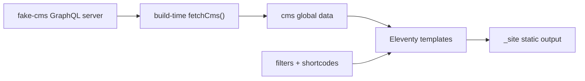
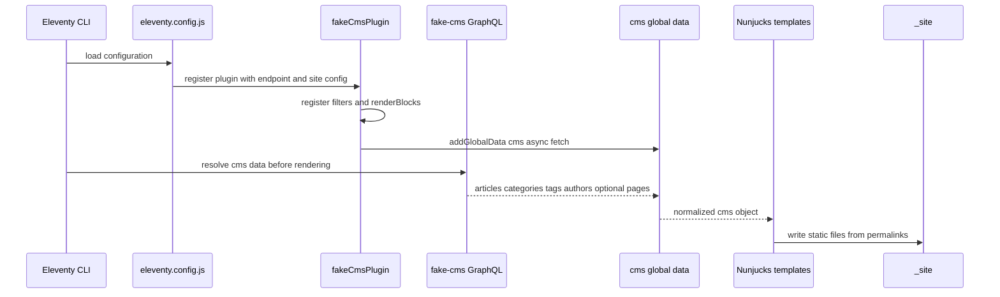

# Corrected 11ty + Fake CMS Static Site Guide

> **Audience:** my younger brother, who wrote a useful first draft but trusted a
> few stale contracts too much, and a new intern who needs to build the solution
> without guessing. This guide keeps the good idea from the first draft — use
> Eleventy to turn GraphQL data into static HTML — but tightens the contract,
> fixes the broken query shapes, and draws a clearer line between what belongs in
> a plugin and what should stay visible as site templates.

---

## 1. What this document corrects

The first guide was helpful because it found the right overall shape: fetch CMS
content at build time, put it into Eleventy's data cascade, render one output
page per CMS entity with pagination, and use filters/shortcodes for repeated
logic. That is still the core design. The part that needed a second pass was the
assumption that the checked-in `schema.graphql` and `internal/doc/api-reference.md`
perfectly match the **executable** server. They do not.

I verified the server by running:

```bash
./fake-cms serve --path testdata/cms.db --addr :18080
```

and querying `http://localhost:18080/graphql`. The evidence is saved in
`sources/22-live-schema-check.md`. The important corrections are:

| First-guide assumption | Verified reality | Implementation consequence |
|------------------------|------------------|----------------------------|
| `pages { ... }` exists. | The running schema has `page(id, slug)`, but no `pages` list. | The SSG cannot enumerate all pages unless we add a backend field or pass known `pageSlugs` as config. |
| `site { ... }` exists. | The running schema has no `site` field. | Site name/base URL/menus must be local 11ty config for now, or the backend must add `site`. |
| `categories(first)`, `tags(first)`, `authors(first)` exist. | The running schema exposes `categories`, `tags`, `authors` with no `first` argument. | Query them without arguments. |
| `articles(filter: { tagSlug: ... })` works. | The executable schema has `filter: String` and a flat `postType` arg; taxonomy filters are not exposed. | Fetch all articles once, then group by tags/categories client-side. |
| `blocks { __typename order ... }` is legal. | `BlockUnion` does not expose `order` directly; use `... on Block { id order }`. | Every render query must spread the `Block` interface. |
| `seo.og` and `seo.twitter` are structured objects. | The executable schema returns them as strings; `jsonLd` is structured JSON. | Use `jsonLd` reliably; treat `og/twitter/breadcrumbs` as backend cleanup items or parse-only-if-fixed. |
| `seo.jsonLd` can be printed directly in a template. | Runtime value is a JavaScript object after GraphQL JSON decoding. | Register a `json` filter that calls `JSON.stringify`, then mark safe. |
| `fake-cms serve` necessarily serves seeded data. | The CLI default path is `cms.db`; it may be empty. The seeded DB is `testdata/cms.db`. | Workshop commands should use `./fake-cms serve --path testdata/cms.db`. |
| `addExtension` is how a plugin ships templates. | `addExtension` teaches 11ty a new template language. Eleventy 3 has `addTemplate` for virtual templates. | Keep normal templates in `src/` first; if plugin-contributed pages are needed, use `addTemplate`. |

The lesson for you, little brother: the shape was right, but you trusted the
paper contract when the executable contract was available. For an SSG, the
executable schema is what breaks the build. Always run at least one query before
writing a guide that includes query code.

---

## 2. What we are building

We are building a static site from a fake CMS. The fake CMS is a local GraphQL
server backed by SQLite. It returns structured content: articles, categories,
tags, authors, blocks, and SEO fields. Eleventy reads data at build time, renders
templates, and writes static files into `_site/`.

The final output should be boring in the best sense: a directory that any static
web server can host. No runtime Node server is needed after build. No GraphQL
calls happen in the browser. The browser receives HTML, CSS, images referenced by
URL, and `sitemap.xml`.

The core flow is:



The frontend has three jobs:

- **Walk the CMS graph.** Fetch every article through cursor pagination; fetch
  categories, tags, and authors; optionally fetch known pages.
- **Normalize the data for templates.** Add URLs, group articles by post type,
  group articles by taxonomy, build sitemap URLs, and serialize JSON-LD safely.
- **Render static pages.** Use one 11ty template per page family: articles,
  post-type archives, categories, tags, authors, optional pages, homepage, and
  sitemap.

---

## 3. Eleventy itself: the part an intern must understand first

Eleventy is a static site generator. It does not have a database layer, router,
or frontend runtime by default. Its job is to take **templates plus data** and
produce **files**. Once the files are written, Eleventy is done.

A minimal Eleventy build has these pieces:

```text
src/                         input directory
  index.njk                  template
  articles.njk               paginated template
  _includes/base.njk          layout
.eleventy.js or eleventy.config.js
_site/                       output directory
```

When the build starts, Eleventy loads the configuration file. The configuration
can add filters, shortcodes, plugins, virtual templates, passthrough copies, and
global data. Then Eleventy reads templates, merges data for each template, renders
the template language, and writes output paths.

### 3.1 The data cascade

Eleventy calls its data merge system the **data cascade**. A template can see
data from global data, configuration global data, directory data, front matter,
and computed data. Higher-priority data overrides lower-priority data. The
official data-cascade source is `sources/13-11ty-data-cascade.md`; the dedicated
`addGlobalData` source is `sources/19-11ty-config-global-data.md`.

For this project, the important API is:

```js
module.exports = function(eleventyConfig) {
  eleventyConfig.addGlobalData("cms", async () => {
    return await fetchCms({ endpoint: "http://localhost:8080/graphql" });
  });
};
```

Eleventy evaluates that async function before rendering templates. Every template
can then read `cms.articles`, `cms.tags`, `cms.authors`, and any derived indexes
we add. I tested the important behavior with Eleventy 3.1.6: async
`addGlobalData` can feed `pagination.data`, and dynamic permalinks using filters
emit the expected static paths.

### 3.2 Pagination is page generation

Pagination is the 11ty mechanism that turns one template into many output files.
For CMS content, this is more important than collections.

```njk
---
pagination:
  data: cms.articles
  size: 1
  alias: article
permalink: "/{{ article.urlPath }}/"
layout: base.njk
---
<h1>{{ article.title }}</h1>

```

If `cms.articles` has 140 entries, this one template renders 140 times. On each
render, `article` is a different item. The `permalink` computes the output path.
This is how a static site generator replaces a web router: it creates the files
up front.

### 3.3 Filters and shortcodes

Filters transform values inside templates:

```njk
{{ article.postType | postTypeSlug }}
{{ article.seo.jsonLd | json | safe }}
```

Shortcodes produce larger fragments:

```njk

```

Filters and shortcodes are good plugin material because they are reusable,
testable, and not specific to one template file.

### 3.4 What plugins are

An Eleventy plugin is configuration packaged as a function:

```js
function fakeCmsPlugin(eleventyConfig, options = {}) {
  eleventyConfig.addGlobalData("cms", async () => fetchCms(options));
  eleventyConfig.addFilter("json", value => JSON.stringify(value));
  eleventyConfig.addShortcode("renderBlocks", blocks => renderBlocks(blocks));
}

module.exports = function(eleventyConfig) {
  eleventyConfig.addPlugin(fakeCmsPlugin, {
    endpoint: "http://localhost:8080/graphql",
  });
};
```

The official plugin source is `sources/11-11ty-create-plugin.md`. A plugin can
register many things, but that does not mean it should hide the whole site. A
plugin is best when it packages **shared behavior**. Templates are best kept as
files the intern can open, edit, and understand.

### 3.5 Are plugins the right tool here?

Yes, but only for the adapter layer. The first implementation should not be a
black-box plugin that secretly generates the whole site. That would make the
workshop worse because students would not see the page-generation patterns.

Use this split:

| Belongs in plugin | Belongs in visible `src/` templates |
|-------------------|-------------------------------------|
| GraphQL client and cursor loop | `articles.njk` page markup |
| Data normalization and URL derivation | `tag.njk`, `category.njk`, `author.njk` archive layout |
| `postTypeSlug`, `json`, URL filters | Homepage decisions |
| `renderBlocks` shortcode/filter | SEO `<head>` partial using the provided `seo` data |
| Optional virtual templates later | Workshop exercises and visual design |

The plugin is right because it creates a reusable boundary around the CMS. It is
wrong if it hides the learning material. If later we need a one-command demo,
Eleventy 3's `eleventyConfig.addTemplate` can add virtual templates from a
plugin (`sources/21-11ty-virtual-templates.md`). Do not use `addExtension` for
that; `addExtension` is for custom template languages.

---

## 4. The current executable CMS contract

The running server is the contract the SSG must survive. Right now it is not the
same as the checked-in SDL in every detail.

Use this command for workshop development:

```bash
./fake-cms serve --path testdata/cms.db --addr :8080
```

The important executable fields are:

```graphql
type Query {
  article(id: ID, slug: String): Article
  page(id: ID, slug: String): Page
  articles(first: Int = 20, after: String, postType: String, filter: String): ArticleConnection!
  categories: [Category]
  category(slug: String): Category
  tags: [Tag]
  tag(slug: String): Tag
  authors: [Author]
  author(slug: String): Author
  media(id: ID!): Media
}
```

The important limitations are:

- There is no `site` field. Put site metadata in local config.
- There is no `pages` list. Either pass `pageSlugs` in config or add a backend
  `pages` query before requiring page output.
- Taxonomy root fields do not expose article lists. Fetch all articles and group
  them client-side.
- `seo.og`, `seo.twitter`, and `seo.breadcrumbs` are currently weakly rendered
  strings. `seo.jsonLd` is the reliable structured SEO payload.

The correct article render fragment is:

```graphql
fragment ArticleRenderFields on Article {
  id
  slug
  title
  excerpt
  postType
  publishedAt
  modifiedAt
  wordCount
  author { id slug displayName description }
  categories { id slug name description }
  tags { id slug name description }
  featuredMedia { id url alt width height caption }
  seo {
    title
    metaDescription
    canonical
    robots
    jsonLd
    og
    twitter
    breadcrumbs
  }
  blocks {
    __typename
    ... on Block { id order }
    ... on ParagraphBlock { text align }
    ... on HeadingBlock { level text anchor }
    ... on ImageBlock { media { id url alt width height } caption link size }
    ... on ListBlock { ordered items }
    ... on QuoteBlock { text citation }
    ... on EmbedBlock { provider url caption }
    ... on GalleryBlock { images { id url alt width height } columns }
  }
}
```

The `... on Block { id order }` line matters. Without it, GraphQL rejects the
query because `BlockUnion` itself does not expose `order`.

---

## 5. Recommended architecture

Build a project-local plugin first. Do not publish an npm package until the
backend schema stabilizes. The plugin can later be moved into a package with no
major rewrite.

```text
frontend/
  eleventy.config.js
  package.json
  _config/
    fakeCmsPlugin.js
    fakeCmsClient.js
    normalizeCms.js
    renderBlocks.js
  src/
    _includes/
      base.njk
      head.njk
      article-card.njk
    index.njk
    articles.njk
    post-type-archive.njk
    tag.njk
    category.njk
    author.njk
    page.njk              optional until page enumeration is solved
    sitemap.xml.njk
```

The build flow is:



The normalized `cms` object should look like this:

```js
{
  site: {
    name: "20 Minutes Media Workshop",
    baseUrl: "http://localhost:8081"
  },
  articles: [
    {
      slug: "reportage-engagé--oenobiol-72",
      postType: "ACTUALITES",
      urlPath: "actualites/reportage-engag%C3%A9--oenobiol-72",
      // original GraphQL fields preserved
    }
  ],
  categories: [{ slug: "actualites", urlPath: "archives/actualites" }],
  tags: [{ slug: "audience", urlPath: "rubrique/audience" }],
  authors: [{ slug: "adminclic-clic-com", urlPath: "author/adminclic-clic-com" }],
  articlesByPostType: { ACTUALITES: [/* articles */] },
  articlesByTagSlug: { audience: [/* articles */] },
  articlesByCategorySlug: { actualites: [/* articles */] },
  sitemapUrls: ["/actualites/…/", "/rubrique/audience/", "/author/…/"]
}
```

Normalize once. Templates should not rebuild indexes repeatedly.

---

## 6. Implementation guide

### 6.1 Install and run

```bash
mkdir frontend
cd frontend
npm init -y
npm install @11ty/eleventy
```

Development command:

```bash
# terminal 1, from repo root
./fake-cms serve --path testdata/cms.db --addr :8080

# terminal 2, from frontend/
npx @11ty/eleventy --serve
```

### 6.2 `eleventy.config.js`

```js
const fakeCmsPlugin = require("./_config/fakeCmsPlugin.js");

module.exports = function(eleventyConfig) {
  eleventyConfig.addPlugin(fakeCmsPlugin, {
    endpoint: process.env.CMS_ENDPOINT || "http://localhost:8080/graphql",
    site: {
      name: "20 Minutes Media Workshop",
      baseUrl: process.env.SITE_URL || "http://localhost:8081",
    },
    // Until the backend exposes a pages list, pages are explicit.
    pageSlugs: ["mentions-legales"],
  });

  return {
    dir: {
      input: "src",
      includes: "_includes",
      output: "_site",
    },
    templateFormats: ["njk", "xml", "css"],
  };
};
```

Using returned `dir` config is the most common Eleventy pattern. The config API
also has `setInputDirectory`, `setOutputDirectory`, and related setters, but the
returned object keeps the project shape visible.

### 6.3 `_config/fakeCmsPlugin.js`

```js
const { fetchCms } = require("./fakeCmsClient.js");
const { normalizeCms, postTypeSlug, pathSegment } = require("./normalizeCms.js");
const { renderBlocks } = require("./renderBlocks.js");

module.exports = function fakeCmsPlugin(eleventyConfig, options = {}) {
  const endpoint = options.endpoint || "http://localhost:8080/graphql";
  const site = options.site || { name: "Fake CMS", baseUrl: "http://localhost:8081" };
  const pageSlugs = options.pageSlugs || [];

  eleventyConfig.addGlobalData("cms", async () => {
    const raw = await fetchCms({ endpoint, pageSlugs });
    return normalizeCms(raw, { site });
  });

  eleventyConfig.addFilter("postTypeSlug", postTypeSlug);
  eleventyConfig.addFilter("pathSegment", pathSegment);
  eleventyConfig.addFilter("json", value => JSON.stringify(value, null, 2));
  eleventyConfig.addFilter("absoluteUrl", function(path) {
    const base = site.baseUrl.replace(/\/$/, "");
    return `${base}${path.startsWith("/") ? path : "/" + path}`;
  });

  eleventyConfig.addShortcode("renderBlocks", blocks => renderBlocks(blocks));
};
```

The plugin has no page markup. It provides data and helpers.

### 6.4 `_config/fakeCmsClient.js`

```js
const ARTICLE_FIELDS = `
  id slug title excerpt postType publishedAt modifiedAt wordCount
  author { id slug displayName description }
  categories { id slug name description }
  tags { id slug name description }
  featuredMedia { id url alt width height caption }
  seo { title metaDescription canonical robots jsonLd og twitter breadcrumbs }
  blocks {
    __typename
    ... on Block { id order }
    ... on ParagraphBlock { text align }
    ... on HeadingBlock { level text anchor }
    ... on ImageBlock { media { id url alt width height } caption link size }
    ... on ListBlock { ordered items }
    ... on QuoteBlock { text citation }
    ... on EmbedBlock { provider url caption }
    ... on GalleryBlock { images { id url alt width height } columns }
  }
`;

async function gql(endpoint, query, variables = {}) {
  const response = await fetch(endpoint, {
    method: "POST",
    headers: { "content-type": "application/json" },
    body: JSON.stringify({ query, variables }),
  });
  if (!response.ok) {
    throw new Error(`GraphQL HTTP ${response.status}: ${await response.text()}`);
  }
  const payload = await response.json();
  if (payload.errors?.length) {
    throw new Error(`GraphQL errors:\n${JSON.stringify(payload.errors, null, 2)}`);
  }
  return payload.data;
}

async function fetchAllArticles(endpoint) {
  const articles = [];
  let after = null;

  for (;;) {
    const data = await gql(endpoint, `
      query Articles($first: Int!, $after: String) {
        articles(first: $first, after: $after) {
          totalCount
          edges { cursor node { ${ARTICLE_FIELDS} } }
          pageInfo { hasNextPage endCursor }
        }
      }
    `, { first: 50, after });

    for (const edge of data.articles.edges) articles.push(edge.node);
    if (!data.articles.pageInfo.hasNextPage) break;
    after = data.articles.pageInfo.endCursor;
  }

  return articles;
}

async function fetchKnownPages(endpoint, pageSlugs) {
  const pages = [];
  for (const slug of pageSlugs) {
    const data = await gql(endpoint, `
      query Page($slug: String) {
        page(slug: $slug) {
          id slug title status publishedAt modifiedAt template
          featuredMedia { id url alt width height caption }
          seo { title metaDescription canonical robots jsonLd og twitter breadcrumbs }
          blocks {
            __typename
            ... on Block { id order }
            ... on ParagraphBlock { text align }
            ... on HeadingBlock { level text anchor }
            ... on ImageBlock { media { id url alt width height } caption link size }
            ... on ListBlock { ordered items }
            ... on QuoteBlock { text citation }
            ... on EmbedBlock { provider url caption }
            ... on GalleryBlock { images { id url alt width height } columns }
          }
        }
      }
    `, { slug });
    if (data.page) pages.push(data.page);
  }
  return pages;
}

async function fetchCms({ endpoint, pageSlugs = [] }) {
  const [articles, categoriesData, tagsData, authorsData, pages] = await Promise.all([
    fetchAllArticles(endpoint),
    gql(endpoint, `{ categories { id slug name description } }`),
    gql(endpoint, `{ tags { id slug name description } }`),
    gql(endpoint, `{ authors { id slug displayName email description avatar { url alt } } }`),
    fetchKnownPages(endpoint, pageSlugs),
  ]);

  return {
    articles,
    categories: categoriesData.categories || [],
    tags: tagsData.tags || [],
    authors: authorsData.authors || [],
    pages,
  };
}

module.exports = { gql, fetchCms };
```

Do not use `articles(filter: { tagSlug: ... })` against the current server. It
is not in the executable schema. Group client-side after fetching all articles.

### 6.5 `_config/normalizeCms.js`

```js
function postTypeSlug(postType) {
  return String(postType || "")
    .toLowerCase()
    .replaceAll("_", "-");
}

function pathSegment(slug) {
  return encodeURIComponent(String(slug || ""));
}

function addArticleUrl(article) {
  return {
    ...article,
    kind: "article",
    postTypeSlug: postTypeSlug(article.postType),
    urlPath: `${postTypeSlug(article.postType)}/${pathSegment(article.slug)}`,
  };
}

function indexByMany(items, getKeys) {
  const out = Object.create(null);
  for (const item of items) {
    for (const key of getKeys(item)) {
      if (!key) continue;
      (out[key] ||= []).push(item);
    }
  }
  return out;
}

function normalizeCms(raw, { site }) {
  const articles = raw.articles.map(addArticleUrl);
  const pages = raw.pages.map(page => ({ ...page, kind: "page", urlPath: pathSegment(page.slug) }));
  const categories = raw.categories.map(c => ({ ...c, kind: "category", urlPath: `archives/${pathSegment(c.slug)}` }));
  const tags = raw.tags.map(t => ({ ...t, kind: "tag", urlPath: `rubrique/${pathSegment(t.slug)}` }));
  const authors = raw.authors.map(a => ({ ...a, kind: "author", urlPath: `author/${pathSegment(a.slug)}` }));

  const articlesByPostType = indexByMany(articles, a => [a.postType]);
  const articlesByTagSlug = indexByMany(articles, a => (a.tags || []).map(t => t.slug));
  const articlesByCategorySlug = indexByMany(articles, a => (a.categories || []).map(c => c.slug));
  const articlesByAuthorSlug = indexByMany(articles, a => [a.author?.slug]);

  const sitemapUrls = [
    ...articles.map(a => `/${a.urlPath}/`),
    ...pages.map(p => `/${p.urlPath}/`),
    ...categories.map(c => `/${c.urlPath}/`),
    ...tags.map(t => `/${t.urlPath}/`),
    ...authors.map(a => `/${a.urlPath}/`),
  ];

  return {
    site,
    articles,
    pages,
    categories,
    tags,
    authors,
    articlesByPostType,
    articlesByTagSlug,
    articlesByCategorySlug,
    articlesByAuthorSlug,
    sitemapUrls,
  };
}

module.exports = { normalizeCms, postTypeSlug, pathSegment };
```

The templates should consume this normalized data. They should not recalculate
URL rules or grouping rules independently.

### 6.6 `_config/renderBlocks.js`

```js
function escapeHtml(value) {
  return String(value ?? "").replace(/[&<>"']/g, c => ({
    "&": "&amp;",
    "<": "&lt;",
    ">": "&gt;",
    '"': "&quot;",
    "'": "&#39;",
  })[c]);
}

function attrs(values) {
  return Object.entries(values)
    .filter(([, value]) => value !== undefined && value !== null && value !== "")
    .map(([key, value]) => ` ${key}="${escapeHtml(value)}"`)
    .join("");
}

function renderBlocks(blocks = []) {
  return [...blocks]
    .sort((a, b) => (a.order ?? 0) - (b.order ?? 0))
    .map(renderBlock)
    .join("\n");
}

function renderBlock(block) {
  switch (block.__typename) {
    case "ParagraphBlock":
      return `<p${attrs({ class: block.align ? `align-${block.align.toLowerCase()}` : undefined })}>${escapeHtml(block.text)}</p>`;

    case "HeadingBlock": {
      const level = Math.min(6, Math.max(2, Number(block.level || 2)));
      return `<h${level}${attrs({ id: block.anchor })}>${escapeHtml(block.text)}</h${level}>`;
    }

    case "ImageBlock": {
      const media = block.media || {};
      const img = ``;
      const linked = block.link ? `<a href="${escapeHtml(block.link)}">${img}</a>` : img;
      return `<figure class="block-image">${linked}${block.caption ? `<figcaption>${escapeHtml(block.caption)}</figcaption>` : ""}</figure>`;
    }

    case "ListBlock": {
      const tag = block.ordered ? "ol" : "ul";
      return `<${tag}>${(block.items || []).map(item => `<li>${escapeHtml(item)}</li>`).join("")}</${tag}>`;
    }

    case "QuoteBlock":
      return `<blockquote><p>${escapeHtml(block.text)}</p>${block.citation ? `<cite>${escapeHtml(block.citation)}</cite>` : ""}</blockquote>`;

    case "EmbedBlock":
      return `<figure class="block-embed block-embed-${escapeHtml(block.provider)}"><a href="${escapeHtml(block.url)}">${escapeHtml(block.url)}</a>${block.caption ? `<figcaption>${escapeHtml(block.caption)}</figcaption>` : ""}</figure>`;

    case "GalleryBlock":
      return `<ul class="block-gallery columns-${escapeHtml(block.columns || 3)}">${(block.images || []).map(img => `<li></li>`).join("")}</ul>`;

    default:
      throw new Error(`Unknown CMS block type: ${block.__typename}`);
  }
}

module.exports = { renderBlocks, renderBlock };
```

Throwing on an unknown block is intentional. It forces a schema/rendering mismatch
to fail at build time instead of silently dropping content.

---

## 7. Templates

### 7.1 `src/_includes/base.njk`

```njk
<!doctype html>
<html lang="fr">
  <head>
    
  </head>
  <body>
    <header><a href="/">{{ cms.site.name }}</a></header>
    <main>{{ content | safe }}</main>
  </body>
</html>
```

### 7.2 `src/_includes/head.njk`

```njk
<meta charset="utf-8">
<meta name="viewport" content="width=device-width, initial-scale=1">
<title>{{ seo.title if seo and seo.title else title if title else cms.site.name }}</title>
<meta name="description" content="{{ seo.metaDescription }}">
<link rel="canonical" href="{{ seo.canonical }}">
<meta name="robots" content="{{ seo.robots }}">

<script type="application/ld+json">{{ seo.jsonLd | json | safe }}</script>

```

Do not print `seo.jsonLd` directly. It is an object in JavaScript. Direct output
would risk `[object Object]`; the `json` filter is the explicit serialization
boundary.

### 7.3 `src/articles.njk`

```njk
---
pagination:
  data: cms.articles
  size: 1
  alias: article
permalink: "/{{ article.urlPath }}/"
layout: base.njk
eleventyComputed:
  title: "{{ article.title }}"
  seo: "{{ article.seo }}"
---
<article class="article article-{{ article.postTypeSlug }}">
  <h1>{{ article.title }}</h1>
  
    
  
  <p class="byline">By <a href="/author/{{ article.author.slug }}/">{{ article.author.displayName }}</a></p>
  
  <footer>
    
      <a href="/rubrique/{{ tag.slug | pathSegment }}/">{{ tag.name }}</a>
    
  </footer>
</article>
```

If the `seo` computed object does not pass through as an object in your exact
Nunjucks setup, use an explicit layout variable convention instead: set
`pageSeo = article.seo` in a JavaScript template or include the head directly in
article pages. Test this early; SEO injection is an acceptance criterion.

### 7.4 Tag and category archives

Do not query the server per tag. The running schema does not expose that filter.
Use client-side indexes built during normalization.

`src/tag.njk`:

```njk
---
pagination:
  data: cms.tags
  size: 1
  alias: tag
permalink: "/{{ tag.urlPath }}/"
layout: base.njk
eleventyComputed:
  title: "Rubrique: {{ tag.name }}"
---
<h1>Rubrique: {{ tag.name }}</h1>

  <article><a href="/{{ article.urlPath }}/">{{ article.title }}</a></article>

```

`src/category.njk` uses `cms.categories`, `/archives/<slug>/`, and
`cms.articlesByCategorySlug[category.slug]`.

### 7.5 Author pages

```njk
---
pagination:
  data: cms.authors
  size: 1
  alias: author
permalink: "/{{ author.urlPath }}/"
layout: base.njk
eleventyComputed:
  title: "Author: {{ author.displayName }}"
---
<h1>{{ author.displayName }}</h1>

  <article><a href="/{{ article.urlPath }}/">{{ article.title }}</a></article>

```

### 7.6 Post-type archives

The current data has post types on articles. Generate archive pages from a small
local array, or add it to `normalizeCms`.

```js
postTypes: ["ACTUALITES", "BEST_CASES", "ETUDES", "BLOG", "SLIDER_DE_UNE", "CARTOUCHES_HOME", "NON_CLASSE"]
```

Then paginate over `cms.postTypes` and render `cms.articlesByPostType[postType]`.

### 7.7 Sitemap

```njk
---
permalink: /sitemap.xml
eleventyExcludeFromCollections: true
---
<?xml version="1.0" encoding="UTF-8"?>
<urlset xmlns="http://www.sitemaps.org/schemas/sitemap/0.9">

  <url><loc>{{ path | absoluteUrl }}</loc></url>

</urlset>
```

The sitemap is built from normalized URLs, not by inspecting `_site` afterward.
That keeps it deterministic and testable.

---

## 8. Testing plan

Test the system at three levels.

### 8.1 GraphQL contract tests

Before running Eleventy, assert the backend contract you depend on:

```bash
./fake-cms serve --path testdata/cms.db --addr :18080
```

Then check:

- `articles(first: 1)` returns `totalCount > 0`.
- `blocks { ... on Block { id order } }` succeeds.
- `blocks { order }` fails, proving the test catches the old bug.
- `site` and `pages` are absent until the backend adds them.

### 8.2 Pure unit tests

Test `postTypeSlug`, `pathSegment`, `normalizeCms`, and `renderBlock` without
Eleventy. These functions carry most of the correctness risk.

Key assertions:

- `BEST_CASES -> best-cases`.
- `rubrique` URLs are generated for tags; `/tag/` never appears.
- `renderBlock` returns different markup for all seven block types.
- `renderBlock({ __typename: "NewBlock" })` throws.
- `JSON.stringify` is used for `seo.jsonLd`.

### 8.3 Eleventy integration test

Use the Eleventy programmatic API (`sources/17-11ty-programmatic.md`):

```js
const { Eleventy } = await import("@11ty/eleventy");

const elev = new Eleventy("src", "_site", {
  config(eleventyConfig) {
    eleventyConfig.addPlugin(fakeCmsPlugin, { endpoint: TEST_ENDPOINT, site: TEST_SITE });
  },
});

const results = await elev.toJSON();
```

Assert:

- There is one article output URL per CMS article.
- No URL starts with `/tag/`.
- At least one URL starts with `/rubrique/`.
- `sitemap.xml` contains every normalized URL.
- Article HTML includes `<script type="application/ld+json">` with valid JSON.

---

## 9. Should we fix the backend first?

For a polished workshop, yes. The SSG can work around the current server, but the
server currently teaches an awkward lesson: the SDL and docs promise more than
the executable schema provides.

The minimum backend fixes that would simplify the frontend are:

1. Add `pages(first, after)` or at least `pages: [Page!]!`.
2. Add `site: Site!` to the executable schema or remove it from the SDL/docs.
3. Make `categories(first)`, `tags(first)`, and `authors(first)` match the SDL,
   or update the SDL to match the executable schema.
4. Make `SEO.og`, `SEO.twitter`, and `SEO.breadcrumbs` structured types in the
   executable schema, not Go `fmt` strings.
5. Decide whether taxonomy archive pages should be built from server-side
   filters (`articles(filter: { tagSlug })`) or from one all-articles fetch.
   Either is fine, but the contract must say one thing.

Until those are fixed, the frontend should target the executable schema and keep
workarounds explicit.

---

## 10. Implementation phases

### Phase 1 — Contract smoke test

Start the seeded server with `--path testdata/cms.db`. Run the live-schema smoke
queries. Do not write frontend code until the contract is known.

### Phase 2 — Local Eleventy skeleton

Create `frontend/`, install Eleventy, and build one hardcoded paginated article
from `addGlobalData`. This proves the 11ty pattern before GraphQL enters.

### Phase 3 — GraphQL client and normalization

Implement `fakeCmsClient.js` and `normalizeCms.js`. Fetch all articles, categories,
tags, and authors. Generate `urlPath`, indexes, and sitemap URLs.

### Phase 4 — Visible templates

Write `articles.njk`, `tag.njk`, `category.njk`, `author.njk`, homepage, and
sitemap. Keep the markup in `src/` so the intern can see the static-site pattern.

### Phase 5 — Block renderer and SEO

Implement all seven block branches. Add `head.njk` and serialize `seo.jsonLd`
with a JSON filter. Add unit tests around both.

### Phase 6 — Optional polish

Add caching, CSS, image optimization, and optional virtual templates only after
the basic workshop acceptance passes.

---

## 11. Notes to my little brother

You were right to reach for Eleventy. You were right that pagination over global
data is the central trick. You were right that a plugin is a useful packaging
boundary. Those are the hard conceptual parts.

The mistakes were the normal mistakes people make when writing from docs instead
of from a running system:

- You copied query shapes from the aspirational SDL/API docs without validating
  them against the executable schema.
- You treated `site`, `pages`, taxonomy filters, and structured SEO as available
  even though the server does not expose them today.
- You selected `order` directly on a GraphQL union, which GraphQL correctly
  rejects.
- You printed `jsonLd` as if it were already a string, but GraphQL JSON becomes a
  JavaScript object.
- You used `addExtension` as a mental model for shipping templates, when Eleventy
  3's `addTemplate` is the relevant virtual-template API.

The fix is not to abandon the architecture. The fix is to make the contract
visible, test it first, and keep the plugin small enough that the templates still
teach the static-site-generation flow.

---

## 12. Final recommendation

Build this as a **project-local Eleventy plugin plus visible templates**.

Do this now:

- Use `addGlobalData("cms", async () => normalizeCms(await fetchCms()))`.
- Fetch all articles with cursor pagination and a correct union fragment.
- Query `categories`, `tags`, and `authors` without `first` arguments.
- Group taxonomy archives client-side.
- Treat pages as optional `pageSlugs` until the backend exposes enumeration.
- Provide local `site` config until the backend exposes `site`.
- Render all seven blocks with a shortcode that throws on unknown types.
- Serialize `seo.jsonLd` with `JSON.stringify` through a `json` filter.
- Keep page templates in `src/` for teaching.

Do this later:

- Publish the plugin as an npm package once the backend contract stabilizes.
- Use `addTemplate` for optional virtual templates if a one-command demo is
  needed.
- Add `@11ty/eleventy-fetch` or `AssetCache` only when repeated network fetches
  become annoying.

This design gives the intern a working path and gives the workshop a useful
lesson: static sites are not magic. They are a disciplined build pipeline from a
known contract, through normalized data, into files.
